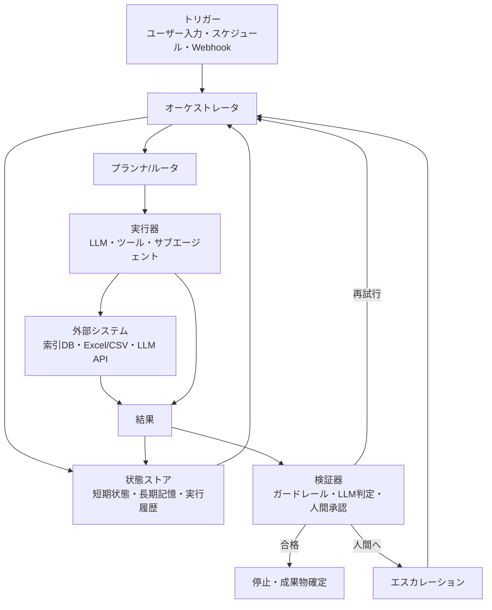

# llmlab Loop — 自律ループシステム 設計書

`python -m llmlab.loopsys`（実装: `src/llmlab/loopsys.py` + UI: `src/llmlab/loop_ui.html`）

「目標」を投入すると、プランナが次の一手を決め、ツールを実行し、検証器が合否を判定し、
**合格するまで自動で回り続ける**エージェントループの典型実装。
llmlab の既存機能（MultiRAG / TableQA / チャットLLM / 長期記憶）がそのままツールとして協調する。

## アーキテクチャ



## 図の各ノード ↔ 実装の対応

| ノード | 実装 | 説明 |
|--------|------|------|
| A トリガー | UI（`POST /api/loop/run`）/ スケジューラ（`_scheduler_loop`）/ `POST /api/webhook` | 3 種類の起動経路。すべて同じ payload 形式 |
| B オーケストレータ | `_orchestrate()` | ループ本体。反復上限・キャンセル・再突入（再試行/人間指示）を制御 |
| C 状態ストア | 短期: `state` dict（goal/observations/feedback/iteration）<br>長期: `~/.llmlab/loop/memory.json`<br>履歴: `~/.llmlab/loop/runs.json` | 長期記憶は実行開始時にプランナの初期観測へ注入（C→B）。結果は観測として state へ、確定結果は履歴へ（G→C） |
| D プランナ/ルータ | `_plan()` | LLM が状態（目標・観測・差し戻し）を読み、次の 1 手を JSON で返す。未知ツール指定時は `llm` へフォールバック（ルータ） |
| E 実行器 | `_execute()` | ツール実行。`rag_search`（MultiRAG）/ `table_calc`（TableQA）/ `llm`（complete）/ `memory_write` / `finish` |
| F 外部システム | 索引ストレージ（`./storage`）・Excel/CSV・OpenAI 互換 LLM API | ツール経由でアクセス。イベントに接続先を表示 |
| G 結果 | `result` dict → `state["observations"]` | 実行結果は観測として短期状態に蓄積され、次の計画の材料になる |
| H 検証器 | `_verify()` = `_guardrails()`（空・長さ上限・禁止語）＋ LLM 判定（JSON `{pass, reason}`）＋ 人間承認（`verify_mode="human"`） | `finish` の成果物のみ検証。差し戻し理由は `state["feedback"]` へ |
| I 停止・成果物確定 | `status="succeeded"` → `final` イベント → 履歴へ記録 | UI の「成果物（確定）」パネルに表示・コピー可 |
| J エスカレーション | 検証 2 連続失敗 → `ask_human` イベント → `wait_human()` でブロック | 人間の指示は feedback として B へ再突入。承認モードでは合格後にも承認を要求 |

## トリガー

1. **ユーザー入力** — UI の「▶ ループ実行」。
2. **スケジュール** — UI で「n 分ごと」を登録（`POST /api/schedules`）。プロセス内タイマーで定期起動。
3. **Webhook** — 外部システム（CI・監視・別アプリ）から:

   ```bash
   curl -X POST http://127.0.0.1:8766/api/webhook \
     -H "Content-Type: application/json" \
     -d '{"goal":"今週の障害報告を要約する","verify_mode":"guard"}'
   ```

スケジュール/Webhook で起動した実行には、UI が自動でアタッチしてライブ表示する
（`GET /api/loop/active` を定期ポーリング）。

## 実行 payload

```json
{
  "goal":        "目標（必須）",
  "indexes":     ["./storage/2024規程", "..."],
  "table_path":  "./data/sales.xlsx",
  "max_iters":   5,
  "verify_mode": "auto | guard | human",
  "banned":      "社外秘, 未確認",
  "demo":        false
}
```

- `indexes` を選ぶと `rag_search` ツール（⑨ MultiRAG）が有効になる。
- `table_path` を指定すると `table_calc` ツール（⑦ TableQA）が有効になる。
- `demo: true` は LLM 未接続でも動く台本実行（再試行→承認→確定まで一通り再現）。

## HTTP API

| メソッド/パス | 役割 |
|---------------|------|
| `GET /` | UI（`loop_ui.html`） |
| `GET /api/status` | 接続状態 |
| `POST /api/configure` | 接続設定（プロセスメモリのみ） |
| `GET /api/indexes` | 索引の自動検出（Studio と同じ `discover`） |
| `POST /api/loop/run` | ループ実行を開始 → `{run_id}` |
| `GET /api/loop/events?id=` | SSE: 段階遷移・計画・実行・検証・最終結果 |
| `POST /api/loop/respond` | 人間応答 `{run_id, decision: approve\|reject\|abort, message}` |
| `POST /api/loop/cancel` | 実行キャンセル |
| `GET /api/loop/active` | 実行中の run 一覧（自動アタッチ用） |
| `GET /api/loop/runs` | 実行履歴 |
| `GET /api/memory` / `POST /api/memory/delete` | 長期記憶の閲覧・削除 |
| `POST /api/webhook` | Webhook トリガー |
| `GET/POST /api/schedules`, `POST /api/schedules/delete` | スケジュール管理 |

## SSE イベント

`stage`（ノード点灯）→ `plan` → `progress` → `exec` → `verify` →
（`ask_human` → `human`）→ `final` → `status` → `done`。
`error` は失敗時。UI のパイプライン図・タイムラインはこのイベント列だけで描画している。

## 安全設計（Studio と同じ方針）

- 標準ライブラリのみ（`http.server`）。追加インストール不要。
- `127.0.0.1` のみに bind し外部公開しない。
- 接続情報（API キー等）はプロセスメモリのみに保持。ファイルへ保存しない。
- ガードレール（空・長さ上限・禁止語）は LLM を使わない一次フィルタとして必ず通る。
- 反復上限（既定 5、最大 10）と人間応答タイムアウト（30 分）で無限ループを防止。

## 拡張ポイント

- **ツール追加**: `_TOOL_SPECS` に仕様を 1 エントリ足し、`_execute()` に分岐を足すだけ。
  例: GitHub 操作、社内 API、MCP クライアント、シェル（要サンドボックス）。
- **検証器の強化**: `_verify()` に JSON Schema 検証・テスト実行などを追加できる。
- **サブエージェント**: `_execute()` から別の `_orchestrate()` を子ループとして呼べば階層化できる。
