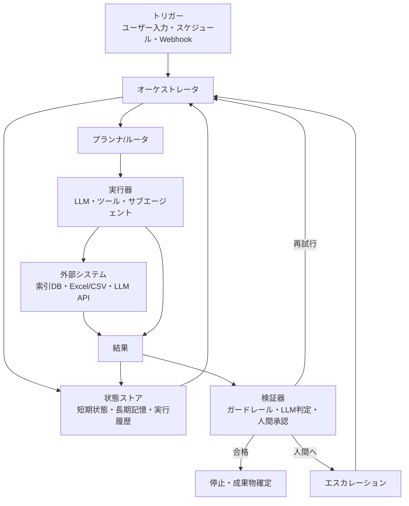
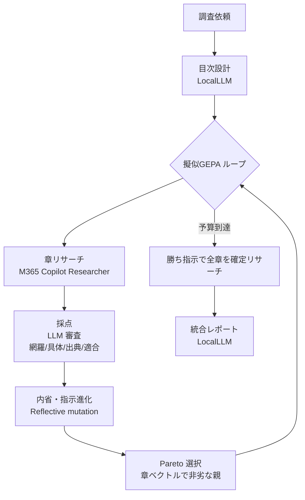

# llmlab — JupyterLab × ローカルLLM コーディング支援

OpenAI 互換エンドポイント（endpoint / api_key / model 名が分かっているローカルLLM）を
**JupyterLab 上で** 使うためのツールキット。コード補完・チャット・各種 RAG を
ひとつのパッケージで賄う。

| # | 機能 | 仕組み | サンプル |
|---|------|--------|----------|
| ① | コード補完 | `%%complete` / `completion_panel()` / 入力中ゴースト補完(同梱 JupyterLab 拡張 `labextension/`) | `01` |
| ② | チャット | `%%llm` マジック / `chat_panel()`（**自前実装・jupyter-ai 不要**） | `01` |
| ③ | RAG（汎用） | `build_rag`：LlamaIndex の素朴なベクトル検索 | `02` |
| ④ | PagedRAG / DocRAG | 標準ベクトル RAG。ページ出典つき・文書単位で問い合わせ | `03` |
| ⑤ | BookRAG（BookRAG-inspired / 軽量版） | 階層Tree(+KG) + エージェント検索（arXiv:2512.03413 に着想。論文の完全再現ではない） | `04` |
| ⑥ | MultiPaperRAG（v2） | 複数論文の横断比較。PDF/Word/Excel、図理解(pics)、エンジン/探索の切替、to_df | `05` |
| ⑦ | TableQA（text-to-pandas） | Excel/CSV への集計・計算・条件抽出を pandas コード生成で解く | `06` |
| ⑧ | DocQA（散文/表の自動振り分け） | 1文書内で 散文→RAG・表→TableQA に自動ルーティング | `07` |
| ⑪ | llmlab Loop（自律ループ） | トリガー→計画→実行→検証→再試行/停止/人間へ。⑨⑦②と協調 | — |
| ⑫ | Copilot Research（M365×擬似GEPA） | 依頼→LocalLLMで目次→章ごとにM365 Copilotでリサーチ→統合。指示を擬似GEPAで進化 | — |

> **接続情報はファイルに保存しない。** すべて **セッション内で入力** する方式
> （`llmlab.configure(...)` / `llmlab.settings_form()`）。
> 補完・チャットは **OpenAI 互換 API だけで自前実装**しており、外部の AI 拡張
> （jupyter-ai 等）には依存しない。

## どれを使う？（早見表）

| やりたいこと | 使うもの |
|--------------|----------|
| セルでコードを書く補助がほしい | ① コード補完 |
| 質問・コード生成を対話で | ② チャット（`%%llm` / `chat_panel`） |
| 表(Excel/CSV)を**集計・計算・条件抽出** | ⑦ `TableQA`（text-to-pandas） |
| **1文書に散文も表もある**（質問で自動に使い分け） | ⑧ `DocQA` |
| 文書をざっと検索したい | ③ `build_rag` |
| 1〜数本の文書を**ページ出典つき**で引く | ④ `PagedRAG` |
| 規程・ハンドブック・論文を**構造・用語の関係まで**踏まえて深掘り | ⑤ `BookRAG` |
| **複数論文を横断**して比較・表の数値比較・図比較 | ⑥ `MultiPaperRAG` |
| **別々に作った索引**（年度フォルダ等）を組み合わせて調べる | ⑨ `MultiRAG` |
| ブラウザの**ワンストップUI**（検索/要約/レポート/数値抽出/グラフ） | ⑩ llmlab Studio（`python -m llmlab.app`） |
| **目標を投げて放置**（計画→実行→検証→再試行 を自動で回す・定期実行・Webhook・人間承認） | ⑪ llmlab Loop（`python -m llmlab.loopsys`） |
| **調査依頼を投げてレポート化**（目次→章ごとに M365 Copilot で調査→統合。指示を擬似GEPAで改良） | ⑫ Copilot Research（`python -m llmlab.copilotresearch`） |

> RAG（③④⑤⑥）は埋め込み API（`/v1/embeddings`）が要る。①②はチャット API だけで動く。
> サーバに埋め込みが無い場合は `configure(embed_provider="local")` でローカル埋め込みも可。

## ノートブック（動かして学ぶ）

| ファイル | 内容 |
|----------|------|
| `notebooks/00_overview.ipynb` | **総合ガイド**（接続設定→各機能を一通り） |
| `notebooks/01_quickstart_chat.ipynb` | 接続設定・コード補完・チャット |
| `notebooks/02_rag.ipynb` | 汎用 RAG（`build_rag`） |
| `notebooks/03_pagedrag.ipynb` | PagedRAG / DocRAG（ページ出典つき） |
| `notebooks/04_bookrag.ipynb` | BookRAG（BookRAG-inspired / 軽量版） |
| `notebooks/05_multipaper.ipynb` | MultiPaperRAG（複数論文の横断比較） |
| `notebooks/06_tableqa.ipynb` | TableQA（表の集計・計算 / text-to-pandas） |
| `notebooks/07_docqa.ipynb` | DocQA（散文=RAG / 表=TableQA の自動振り分け） |

---

## セットアップと起動

```bash
# 1. このプロジェクトへ移動
cd jupyter-local-llm

# 2. 仮想環境を作って依存をインストール（初回だけ）
python -m venv .venv
source .venv/bin/activate          # Windows: .venv\Scripts\activate
pip install -e .                    # もしくは: pip install -r requirements.txt

# 3. JupyterLab を起動（ブラウザが開く）
jupyter lab
```

あとはノートブックで接続情報を入力し（下記）、`%%complete` / `completion_panel()` /
`%%llm` / `chat_panel()` を使う。外部拡張のインストールや設定は不要。

### 追加機能の任意依存（必要なときだけ）

基本の `pip install -e .` で①〜⑤の中心機能は動く。次の機能は任意依存:

```bash
pip install -e ".[tables]"           # MultiPaperRAG の表抽出（PDF, pdfplumber）
pip install -e ".[office]"           # Word(.docx)/Excel(.xlsx) の本文・表
pip install -e ".[figures]"          # 図理解 pics=True（pymupdf）＋ 画像対応モデルが必要
pip install -e ".[local-embeddings]" # サーバに /v1/embeddings が無い場合のローカル埋め込み
pip install -e ".[sandbox]"          # TableQA の本格サンドボックス（RestrictedPython）
pip install -e ".[ocr]"              # スキャンPDF の OCR / 版面解析（pymupdf + pytesseract）※要 Tesseract 本体
pip install -e ".[rerank]"           # BookRAG のローカル rerank（CrossEncoder）
pip install pandas                   # Comparison.to_df()
# まとめて:
pip install -e ".[tables,office,figures,local-embeddings,sandbox,ocr,rerank]"
```

**高精度化オプション（任意）**
- **スキャンPDF/版面解析**: `BookRAG().add_book("scan.pdf", ocr="auto", layout="auto")`
  — pymupdf のフォントサイズで見出し階層を判定し、テキストの薄いページは OCR。
  `layout="mineru"` で MinerU(magic_pdf) 導入時はそれを使用。OCR は Tesseract 本体
  （日本語は `jpn` 言語データ）が別途必要。
- **rerank**: `BookRAG(reranker="local")`（CrossEncoder）/ `reranker="endpoint"`（`/v1/rerank`）
  / 既定 `"cosine"`（埋め込み）。検索（Text_Reasoning）の精度が上がる。
- **TableQA サンドボックス**: RestrictedPython 導入時は AST レベルで import・dunder 属性・
  危険構文をコンパイル段階で禁止（未導入時は builtins 最小化 + deny-list にフォールバック）。

> **VLM を使わない場合**: `MultiPaperRAG(pics=False)`（既定）なら VLM も pymupdf も一切
> 呼ばれず、埋め込みベースの検索だけで動く（＝v1 と同じ挙動）。図理解が要るときだけ
> `pics=True` にする。

---

## 使い方

### 接続設定（最初に1回 / セッションごと）

ノートブックの先頭で接続情報を入力する。

```python
import llmlab
llmlab.settings_form()          # フォームで入力（API Key はマスク表示）
```

またはコードで直接:

```python
llmlab.configure(
    base_url="http://localhost:8000/v1",
    api_key="...",
    model="your-model-name",
    embed_model="your-embedding-model",   # RAG 用（省略時は model を流用）
)
```

### ① コード補完（自前実装・jupyter-ai 不要）

OpenAI 互換 API だけでコードを補完する。関数・マジック・UI の3通り。

```python
# 関数として
from llmlab import code_complete
code_complete("def fib(n):\n")                       # 続きのコードを返す
code_complete("def f(", suffix="):\n    pass")        # fill-in-the-middle（中央補完）
```

```python
%load_ext llmlab.complete
```
```
%%complete
def quicksort(arr):
```
`%%complete` はセルのコードを補完し、**「元コード＋補完」を編集可能な新規セルとして下に挿入**
する（`--no-insert` で挿入なし、`--lang sql` で言語指定）。

```python
import llmlab
llmlab.completion_panel()      # 入力欄＋「補完」ボタンの UI
```

#### 入力中のゴーストテキスト補完（任意・JupyterLab 拡張）

セルに入力している最中に続きを薄い文字で提案し `Tab` で確定する Copilot 風の補完は、
JupyterLab のフロントエンド拡張が必要（純 Python では不可）。同梱の拡張
`labextension/`（`jupyterlab-llmlab-completer`）を**一度ビルド**すれば使える。

```bash
cd labextension
pip install -e .
jupyter labextension develop . --overwrite
jlpm build
```
補完は**アクティブなカーネル経由**で動くため、ノートブックで `llmlab.configure(...)` した
設定をそのまま使う（追加設定不要）。詳細・有効化手順は `labextension/README.md`。

### ② チャット（マジック / パネル）

```python
from llmlab import complete
complete("pandas で CSV を読み込むコードを書いて")     # 単発
```

```python
%load_ext llmlab.chat
```
```
%%llm
この関数をベクトル化して高速化して
```
`%%llm` は会話履歴を保持する。`%%llm --new` でリセット。

```python
import llmlab
llmlab.chat_panel()            # ノートブック内のチャット UI（送信/クリア）
```
→ 詳細は `notebooks/01_quickstart_chat.ipynb`

### ③ RAG

`docs/` に資料を置いて:

```python
engine = llmlab.build_rag("./docs")
print(engine.query("この資料の要点は？"))
```
インデックスは `./storage` に保存され再利用される。`rebuild=True` で作り直し。
→ 詳細は `notebooks/02_rag.ipynb`

### ④ PagedRAG / DocRAG（文書をページ出典つきで）

文書を「**書名・ページ番号つきの出典**」で問い合わせる標準ベクトル RAG。
複数文書を1インデックスで管理し、文書単位の絞り込みもできる。

```python
rag = llmlab.PagedRAG()           # DocRAG は別名
rag.add_book("./docs/営業マニュアル.pdf", title="営業マニュアル")  # 1冊ずつ
# rag.add_books("./docs")                                        # まとめて

print(rag.ask("返品の手順は？"))                  # 回答＋ページ出典を表示
print(rag.ask("料金体系は？", title="営業マニュアル"))  # 特定文書だけに絞る
rag.books()                                        # 取り込み済み一覧
```

- 出典は `Answer.sources`（`title` / `page` / `score` / `snippet`）で構造化取得も可能
- インデックスは `./storage/books` に永続化。全消去は `rag.reset()`
→ 詳細は `notebooks/03_pagedrag.ipynb`

### ⑤ BookRAG（BookRAG-inspired / 軽量版・arXiv:2512.03413 に着想）

論文 *BookRAG: A Hierarchical Structure-aware Index-based Approach for RAG on Complex Documents*
の手法を OpenAI 互換エンドポイント上で再現した実装。**構造の濃い長尺文書**（ハンドブック・規程・論文）向け。

```python
book = llmlab.BookRAG()
book.add_book("./docs/handbook.pdf", title="Handbook")  # BookIndex を構築
book.info()                                              # ノード/エンティティ/関係数

ans = book.ask("How does X differ from Y?")
print(ans)              # 回答 + 分類/プラン + 根拠ノード（書名・ページ・G/Tスコア）

book.tree()             # 構築された木を ASCII アートで確認（構造のデバッグに）
# Handbook
# ├─ [S1] 第1章 概要 p.1
# │   ├─ (Text#2 p.1, 812字) 本章では…
# │   └─ (Tbl#5 p.3) モデル | 精度 | 速度
# └─ [S1] 第2章 手順 p.4
book.tree(show_entities=True)   # ノードごとの紐づきエンティティ数も表示
```

**仕組み**:
- **BookIndex `B=(T,G,M)`** … 文書から論理階層の **木 T**（Section/Text/Table/Image）を抽出し、
  各ノードから **KG G**（エンティティ＋関係）を構築。**GT-Link M** がエンティティをノードへ対応付ける。
  名寄せは論文の **Gradient-based Entity Resolution（Algorithm 1）** を実装（しきい値 `g=0.6`）。
- **エージェント検索** … クエリを **single-hop / multi-hop / global** に分類し、Operator
  （Extract・Decompose・Select_by_Entity/Section・Filter_*・Graph_Reasoning(PageRank×GT-Link)・
  Text_Reasoning・**Skyline_Ranker**・Map/Reduce）を組み合わせて実行。

**速度（取り込みは LLM 抽出が走るため重い）— 既定で高速側に振っている**:
- 本文は段落ごとでなく **章単位のチャンク**（`chunk_chars`、既定 1500）→ LLM 呼び出しを大幅削減
- 取り込みノードに **上限**（`max_nodes`、既定 300。超過は警告して打ち切り）
- 名寄せの LLM 判定は **既定 OFF**（`er_use_llm=False`）。見出し判定も既定ヒューリスティック
- **進捗バー**（tqdm）で「解析→見出し→木→抽出→名寄せ→保存」の各フェーズを表示
- 精度を上げたいとき: `BookRAG(er_use_llm=True)` / `add_book(use_llm_sections=True, max_nodes=...)`

```python
book = llmlab.BookRAG(chunk_chars=1500, max_nodes=300, max_workers=8, er_use_llm=False)
```

**対応ファイル形式**:
- **.md / .markdown（最良）** — 見出しから階層を正確に構築
- **.pdf** — テキスト層をヒューリスティックで解析（スキャンPDFは不可）
- **.docx（良好）** — 見出しスタイル(Heading n)から階層を復元、表は Table ノードに（要 `python-docx`）
- **.pptx / .xlsx（一応可・低精度）** — 取り込み時に警告を表示。階層/散文が無いため木・知識グラフの
  精度が落ちる。推奨: PowerPoint→検索は PagedRAG、Excel→計算は TableQA・検索は PagedRAG・混在は DocQA
  （要 `python-pptx` / `openpyxl`）
- .txt 等 — 段落を本文として取り込み

**論文との差分と“論文最接近”プリセット**:
既定は速度優先の簡略構成（見出しヒューリスティック・コサインER・VLMなし）。
オプションを全て有効にすると論文構成にほぼ一致する:

```python
book = llmlab.BookRAG(
    er_use_llm=True,        # Algorithm 1 の LLM 名寄せ判定
    reranker="endpoint",    # Rerank model R（ER と Text_Reasoning 両方に使用）
    vlm=True,               # 図を VLM が読解して Image ノード化（画像対応モデルが必要）
    # vlm_model="your-vision-model",   # 通常のローカルLLMのみなら vlm=False のまま
)
book.add_book("paper.pdf", use_llm_sections=True, layout="mineru", ocr="auto")
```
- 表は v_table エンティティ + ヘッダを ContainedIn で構造化（論文 4.3.1）
- Section Filtering は確定済み上位節をバッチ間で持ち回り（論文 4.2.2）
- global 集計は件数が多いとき Map（バッチ分析）→ Reduce（論文 5.3）
- 残る差分: 版面解析の既定は MinerU でなく pymupdf（`layout="mineru"` で切替可）

> **③/④ と ⑤ の使い分け**: 雑多な文書を手早く検索 → ③ `build_rag`。文書をページ出典つきで
> 引く → ④ `PagedRAG`。**階層・表・横断参照が重要な複雑文書で精度を取りに行く** → ⑤ `BookRAG`。
> BookRAG は取り込みが重いので、速度優先なら ③④ で十分なことも多い。
→ 詳細は `notebooks/04_bookrag.ipynb`

### ⑥ MultiPaperRAG（v2 / 複数論文の横断比較）

複数の論文を **「広く探す → 論文ごとに深掘り → 突き合わせて比較」** で横断比較する
オーケストレーション層。**PDF / Word(.docx) / Excel(.xlsx)** を入力でき、図理解・
エンジン/探索の切替・DataFrame 出力に対応。

```python
mp = llmlab.MultiPaperRAG(
    deep_engine="paged",       # "paged"(速い) / "book"(BookRAGで構造的に深掘り)
    locate_strategy="search",  # "search"(横断検索) / "summary"(要約でLLM選別) / "all"(全件)
    pics=False,                # True で PDF ページ画像を VLM に渡し図・グラフを理解
    vlm_model=None,            # pics=True 時の画像対応モデル名（省略時は model）
)
mp.add_papers("./papers")                          # PDF/Word/Excel をまとめて取り込み

cmp = mp.compare("提案手法の精度を論文間で比較して")    # 探す→深掘り→比較
print(cmp)
cmp.to_df()                                          # 論文ごとの結果を pandas DataFrame に

print(mp.compare_table("ImageNet accuracy"))         # 表の数値を横断で比較表に
print(mp.compare_figures("各論文のグラフの傾向を比較")) # pics=True 時、図の説明を横断比較
```

**切替の要点**
- `deep_engine`: 深掘りを ④PagedRAG（既定・速い）か ⑤BookRAG（構造・関係まで踏まえる・重い）で
  - `deep_engine="book"` のとき、⑤の高速化（チャンク化・max_nodes・er_use_llm=False・進捗バー・
    タイムアウト）を**そのまま継承**。取り込みは `add_paper` 時に構築（初回 compare で突然重くならない）。
    調整は `MultiPaperRAG(deep_engine="book", book_kwargs={"chunk_chars":2000,"max_nodes":150})`
- `locate_strategy`: 候補論文の選び方（横断検索／要約でLLM選別／全件）
- `pics=True`: PDF を画像化して VLM が図を読む（`compare`/`compare_figures` で活用）

**文書間検索の多様化（v0.5.1〜）**: `locate_strategy="search"` は「全チャンクから top-k を
取る」方式だと1文書のチャンクが上位を独占して候補が偏っていた。現在は **doc_id 単位で候補を
集約**する（広めに `candidate_chunk_k` チャンクを取得 → 文書ごとに group by → 文書スコア=最大
または上位平均 → 上位 N 文書）。`chunks_per_doc`（文書ごとに使うチャンク数）で調整できる。
各文書には安定な `doc_id`（絶対パス由来。同名ファイルでも衝突せず、title に関係なく再取り込みは
冪等）が付き、`storage/multipaper/documents/{doc_id}.json` に中身（チャンク）が保存され個別確認
できる。低レベルAPI: `PagedRAG.rank_documents(q, candidate_chunk_k=, top_n=, chunks_per_doc=)` /
`PagedRAG.query(q, doc_id=...)` / `PagedRAG.document(doc_id)`。

**必要な任意依存（未導入なら該当機能のみスキップ＋案内）**
- 表抽出: `pip install pdfplumber`（PDF）、`python-docx`（Word）、`openpyxl`（Excel）
- Word/Excel 本文: `pip install "llama-index-readers-file" docx2txt openpyxl pandas`
- 図理解(pics): `pip install pymupdf` ＋ 画像入力対応モデル
- `to_df()`: `pip install pandas`
- まとめて: `pip install -e ".[tables,office,figures]"`

**v2 の割り切り**: 図理解はページ全体を VLM に渡す方式（領域検出なし）。複雑な結合セルの表は
不完全な場合あり。`deep_engine="book"` は論文ごとに BookIndex を構築するため初回が重い。
→ 詳細は `notebooks/05_multipaper.ipynb`

### ⑦ TableQA（text-to-pandas / 表の集計・計算）

RAG（検索）が苦手な **集計・計算・条件抽出** を、pandas コードを LLM に生成させて解く。
Excel / CSV / DataFrame を扱える（要 `pip install -e ".[office]"`）。

```python
tq = llmlab.TableQA("売上.xlsx")          # CSV / DataFrame / {name: DataFrame} も可
ans = tq.ask("東京支店の4月の売上合計は？")
print(ans)            # 回答（自然言語）＋ 生成コード ＋ 実行結果
ans.result            # 計算結果そのもの（数値/DataFrame）
tq.code("解約率が5%を超える月は？")   # 生成される pandas コードだけ確認
```

**RAG と組み合わせる（検索 → 計算）**:
```python
# 1) どのシート/表が関係するかは PagedRAG 等で当たりをつけ、
# 2) 該当ファイルを TableQA に渡して集計する、という2段が実用的
tq = llmlab.TableQA("売上.xlsx", sheet="2024")
print(tq.ask("四半期ごとの売上平均を出して"))
```

- **使い分け**: 「特定の値・行を探す」→ RAG（PagedRAG）。「合計/平均/件数/条件抽出などの計算」→ TableQA。
- **安全性**: LLM 生成コードを実行するため、`import`/`os`/`__` 等の危険トークンを含むコードは拒否し、
  builtins を最小化した名前空間で実行する（完全なサンドボックスではない。信頼できるローカル環境向け）。
→ 詳細は `notebooks/06_tableqa.ipynb`

### ⑧ DocQA（1文書内で 散文=RAG / 表=TableQA を自動振り分け）

同じファイルの中で、**本文（散文）は PagedRAG**、**表は抽出して TableQA** に回す。
`ask()` が質問を分類し、計算・集計・条件抽出 → 表(TableQA)、説明・検索 → 本文(RAG) に
自動ルーティングする。

```python
doc = llmlab.DocQA("report.pdf")     # PDF / Excel / Word / CSV
print(doc.ask("この資料の要点を3つ"))      # → 本文RAG
print(doc.ask("売上の合計と平均は？"))       # → 表TableQA
print(doc.ask("四半期の推移", route="table"))  # route="rag"/"table" で強制も可
doc.table_names()                           # 抽出された表の一覧
```

- 表抽出: PDF=pdfplumber / Excel=各シート / Word=python-docx / CSV
- ルーティング: LLM 分類＋計算語ヒューリスティック。表が無い質問は自動で RAG にフォールバック
- 依存: `pip install -e ".[tables,office]"`（表抽出）＋ 本文RAG は埋め込みAPI が必要
→ 詳細は `notebooks/07_docqa.ipynb`

### ⑨ MultiRAG — 別々に作った索引を横断して調べる

PagedRAG / BookRAG の索引はフォルダ単位で自己完結しているので、
別プロセス・別日に作ったものを後から組み合わせられる
（例: 2014年フォルダの索引 + 2015年フォルダの索引）。

```python
ws = llmlab.MultiRAG(["./storage/2014", "./storage/2015"])  # 種類は自動判別
print(ws.ask("売上高の推移は？"))       # 索引ごとに調べて突き合わせ（横断QA）
print(ws.summarize())                   # 横断要約
print(ws.report("年度比較レポート"))     # Markdown レポート生成
ex = ws.extract("各年の売上高と利益")    # 数値抽出 → ex.to_df() で DataFrame
llmlab.MultiRAG.discover("./storage")   # フォルダ内の索引を自動検出
```

- 各索引はそれぞれの方式（paged=ベクトル検索 / book=エージェント検索）で調べ、
  結果を LLM が突き合わせて最終出力を作る（索引名を明示して回答）
- 回答には「── リファレンス（該当箇所） ──」として元ファイルの**絶対パス**と
  ページを表示（v0.3.1 以降に取り込んだ索引）
- **注意**: 索引ごとに順番に調べるため、処理時間はほぼ索引数に比例して長くなる
  （選択が3個以上、または book 索引を含むときは警告を表示）
- 組み合わせる索引は**同じ埋め込みモデル**で作られている必要がある

よく使う索引フォルダは**ピン留め**できる（`~/.llmlab/pins.json` に永続化。
接続情報と違い秘匿情報ではないため、再起動後も残る）:

```python
llmlab.pin_index("./storage/2014")      # ピン留め（Studio では📌ボタン）
llmlab.pinned_indexes()                 # ピン一覧（消えたフォルダは kind="missing"）
ws = llmlab.MultiRAG.pinned()           # ピン留めした索引だけで横断
llmlab.unpin_index("./storage/2014")    # 外す
```

### ⑩ llmlab Studio — ブラウザのワンストップUI

検索/QA・要約・レポート生成・数値抽出・グラフ作成を1画面で行う
ローカルWebアプリ（追加インストール不要・標準ライブラリのみ）。

```bash
python -m llmlab.app                 # http://127.0.0.1:8765
python -m llmlab.app --port 9000 --root ./storage
```

ノートブックからは `llmlab.launch_app()` でバックグラウンド起動。

- 索引フォルダを自動検出し、✓ で検索対象を選ぶ（増やすと時間がかかる旨を警告表示）
- **＋ 索引を作成**: 文書フォルダのパスと索引名を入れて「作成開始」するだけで
  フォルダ→索引化（PAGED/BOOK 選択、進捗バー付き。既存索引名なら追記）。
  Python からは `llmlab.build_index("./docs/2016", "./storage/2016")`
- **📌 ピン留め**: よく使う索引を先頭に固定（再起動後も残る。root 外のピンも表示）
- **🕘 履歴**: 過去の質問をクリックすると質問・アクション・索引の選択まで復元
- **プリセット質問**: 「要点を3行で」「主要な数値を抽出」等をワンクリック入力
- 進捗はプログレスバー + **経過秒数**でリアルタイム表示。Ctrl+Enter で実行
- 数値抽出は 表ビュー + CSV 保存 + 棒/折れ線グラフ（SVG、凡例・ツールチップ付き）
- 結果の下に 📎リファレンス（元ファイルの絶対パスリンク + パスコピー）
- 前回の root・選択・質問はブラウザに記憶され、次回開いたとき復元される
- 接続設定に**接続テスト**ボタン（/v1/models を叩いて疎通と利用可能モデルを確認）
- 接続情報（APIキー等）は UI から入力し**プロセスメモリのみ**に保持(ファイル保存なし)。
  127.0.0.1 のみに bind し外部公開しない
- **文書管理ビュー（ヘッダの「文書管理」）**: ⑬ IndexManager を GUI から操作する。
  文書追加（index_mode 選択）・文書一覧（doc_id/モード/状態/chunks/graph）・詳細（JSON/
  チャンク/セクション）・再構築・削除に加え、**回答生成 / 要約 / チャンク検索** の
  3アクション（`対象文書数`/`文書内チャンク`/`最大チャンク`/`BookRAG(graph)を使う`）。
  「要約してください」のような依頼文にも応え、一覧の ✓ で対象文書を絞れる。
  graph 未作成の文書に BookRAG 検索を要求しても落とさず通常RAGにフォールバックし、
  その旨を各文書に表示する。

### ⑬ IndexManager — index_mode で速度と精度を選ぶ文書間RAG（ローカルLLM実用重視）

文書投入時の LLM 処理量を **index_mode** で選ぶ。既定は高速な `fast`。BookRAG Full 相当の
`graph`（Entity/Relation 抽出）は**明示時だけ**動く高コスト拡張。`graph` 未作成でも
`fast`/`hierarchy` の検索は動く。

| index_mode | 何を作るか | 速度 | 推奨用途 |
|---|---|---|---|
| `fast`（既定） | doc_id + チャンク + 埋め込み | 速い | 通常の文書間RAG。まずこれ |
| `hierarchy` | 見出し/セクション階層 + チャンク（抽出なし） | 中 | 構造の濃い規程・ハンドブック |
| `graph` | 上記 + Entity/Relation 抽出（BookRAG Full 相当） | 低速 | 用語の関係まで辿りたいときだけ |

```python
im = llmlab.IndexManager()                       # 既定 ./storage/index
im.add_document("./docs/2024規程.pdf")            # fast（既定・高速）
im.add_document("./docs/規程.pdf", index_mode="graph")   # 明示時だけ重い抽出
im.documents()                                    # doc_id 単位の一覧（title/status/mode…）
im.document(doc_id)                               # メタ + status + チャンク + 木の要約
res = im.search("退職金は？", document_top_n=4, chunk_top_k_per_doc=4, use_graph=False)
for h in res: print(h.title, h.doc_id, h.score, len(h.chunks))
print(im.ask("退職金の計算方法は？"))              # 回答を生成（要約・比較などの依頼文もOK）
print(im.summarize())                              # 文書ごとに要約 → 統合要約
print(im.summarize("リスク面を中心に", doc_ids=[doc_id]))  # 観点・対象文書の指定
im.rebuild(doc_id, index_mode="hierarchy")        # 作り直し（force 相当）
im.delete(doc_id)
```

- **doc_id は内容ハッシュ**。title/ファイル名は識別子にしない（同名・版違い・別ファイルを区別）。
- 文書ごとに JSON を個別保存: `storage/index/{docs,chunks,status}/{doc_id}.json` と
  `bookindex/{doc_id}/`（hierarchy/graph のとき）。確認・再構築・削除ができる。
- **キャッシュ/差分更新**: 同じ doc_id・同じ content_hash・同じモードで ready なら再抽出せず
  `skipped`。作り直しは `force=True`（GUI では「再構築」）。
- **status**: `pending`/`running`/`ready`/`failed`/`skipped`。失敗は握りつぶさず
  `status/{doc_id}.json` の `error` と GUI に表示。
- **検索は2段階**: まず doc_id 単位で候補文書 top-N → 各文書内で chunk top-k。全チャンク
  global top_k を避け、1文書に偏らない（`document_top_n`/`chunk_top_k_per_doc`/
  `max_chunks_per_doc`）。`use_graph=True` は graph 索引がある文書のみ BookRAG 検索、
  無ければ通常RAGへフォールバック。

### ⑪ llmlab Loop — 自律ループシステム（既存機能と協調するエージェントループ）

「目標」を投げると、**プランナが次の一手を決め → ツールを実行し → 検証器が合否を判定し、
合格するまで自動で回り続ける**ローカルWebアプリ（追加インストール不要・標準ライブラリのみ）。
既存機能がそのままツールとして協調する: `rag_search`（⑨ MultiRAG）・`table_calc`（⑦ TableQA）・
`llm`（② チャットLLM）・`memory_write`（長期記憶）。

```bash
python -m llmlab.loopsys             # http://127.0.0.1:8766
python -m llmlab.loopsys --port 9100 --root ./storage
```

ノートブックからは `llmlab.launch_loop()` でバックグラウンド起動。



- **トリガー3種**: UI からの実行 / **スケジュール**（n分ごとの定期実行）/ **Webhook**
  （`POST /api/webhook` — CI・監視・別アプリから起動。UI に curl 例つき）
- **パイプラインの可視化**: 上図と同じ構成のノードが実行に合わせて点灯し、
  再試行・エスカレーションの流れがそのまま見える
- **RAGモード（検索特化ループ / CRAG・Self-RAG 型）**: クエリ書き換え→横断検索→関連性グレード→
  （不足なら書き換えへ戻る）→出典つき生成 の固定フロー。検証器は出典チェック（[番号] 引用必須）+
  忠実性判定（根拠への裏付け）。UI に「RAG インナーループ」の進行が表示される
- **検証モード3種**: 自動（ガードレール + LLM判定）/ ガードレールのみ（空・長さ・禁止語）/
  **人間承認（HITL）** — 合格後に UI で承認・差し戻し（コメントはプランナへ渡る）
- **再試行とエスカレーション**: 差し戻し理由を次の計画へフィードバック。
  連続で失敗すると人間へエスカレーションし、指示を受けて再開
- **状態ストア**: 長期記憶（`~/.llmlab/loop/memory.json`）は次回以降の実行に自動で注入され、
  実行履歴（`runs.json`）は UI から再実行できる
- **デモ実行**: LLM 未接続でも台本でループ全体（再試行→承認→確定）を体験できる
- Studio と同じ方針: 標準ライブラリのみ・127.0.0.1 のみ・接続情報はプロセスメモリのみ・SSE で
  リアルタイム配信。詳細は `LOOP_SYSTEM.md`

---

### ⑫ Copilot Research — M365 Copilot × 擬似GEPA リサーチ

**調査依頼を投げると、LocalLLM が目次（章立て）を設計し、各章を M365 Copilot の
リサーチエージェント（Researcher）経由で調べ、1 本のレポートに統合する**ローカル Web アプリ
（追加インストール不要・標準ライブラリのみ）。章に投げる「リサーチ指示」は **擬似GEPA
（Reflective Prompt Evolution + Pareto 選択）** で反復改良する。

```bash
python -m llmlab.copilotresearch          # http://127.0.0.1:8767
python -m llmlab.copilotresearch --port 9200
```

ノートブックからは `llmlab.launch_copilot_research()` でバックグラウンド起動。



- **擬似GEPA**: 最適化対象は「各章プロンプトに共通で差し込むリサーチ指示文」。章を
  minibatch で評価して章ごとのスコア・ベクトルを取り、弱い章のトレース＋審査フィードバックを
  LLM に内省させて指示を変異、章ベクトル上の **Pareto フロンティア**から次の親を選ぶ
  （全体最良でなくても、ある章で最良の候補は生き残る＝多様性を保つ）。UI に候補の系譜・
  Pareto バッジ・スコア推移曲線が出る。
- **M365 Copilot コネクタ 4 種**（差し替え可能・`m365copilot.py`）:
  - `bridge`（**既定・確実**）: 各章のプロンプトを画面に出す → 人が M365 Copilot に貼り、
    回答を貼り戻す（自動化/APIが塞がれた社内環境でも動く）
  - `selenium`: **Edge（既定）/ Chrome** を Selenium WebDriver で実駆動（初回 SSO ログイン・永続
    プロファイル）。M365 Copilot は Edge + 業務アカウントで使うことが多いため既定は Edge。
    **WebDriver の場所は `driver_path` で明示指定可**（msedgedriver / chromedriver。未指定なら
    Selenium Manager が自動解決。環境変数 `EDGEDRIVER_PATH` / `CHROMEDRIVER_PATH`、
    `EDGE_BINARY` / `CHROME_BINARY` でも可）。`agent_selector` で Researcher を自動選択。
    **待機（ウェイト）**: 入力欄の出現待ち（`ready_timeout_ms`）、送信後の初期待機（`initial_wait_ms`）、
    ポーリング間隔（`poll_ms`）、**生成中インジケータが消えるまで待つ `busy_selector`**、
    伸びが止まってからの静止確定 `settle_ms`、全体上限 `timeout_ms`（既定 5 分。Researcher は長い
    ので必要に応じ増やす）。待機中は ~10 秒ごとに経過秒を UI へ配信
  - `graph`: 任意の HTTP エンドポイント（Microsoft Graph / 社内 Copilot プロキシ）へ Bearer POST。
    プロンプト/回答の JSON パスは設定可能
  - `demo`: モック（指示が濃いほど回答も濃くなり、擬似GEPA の改善が見える）
- **便利機能**: 目次の**人手編集**（生成→確認・追加/削除してから実行）／コネクタ**接続テスト**／
  各章の**出典・採点の可視化**／**Markdown レポートのコピー & ダウンロード**／
  **実行履歴**（レポート全文つき・クリックで再表示、`~/.llmlab/copilot/runs.json`）
- **並行実行**: 複数のリサーチを同時に走らせても各 run は独立（候補IDも run ごとに採番）。
  ただし `selenium` を同時に使う場合だけは run ごとに別 `user_data_dir` を指定すること
  （Chrome は 1 プロファイルを同時に開けないため）。demo / bridge / graph は同時実行可
- **デモ実行**: LLM も M365 も未接続で 目次→擬似GEPA→統合 を一通り体験できる
- Studio / Loop と同じ方針: 標準ライブラリのみ・127.0.0.1 のみ・接続情報はプロセスメモリのみ・
  SSE でリアルタイム配信

---

## トラブルシューティング

### フォーム/パネルが表示されず `VBox(...)` というテキストだけ出る

ipywidgets が**描画できない環境**で実行しています。よくある原因と対処:

```python
import llmlab
llmlab.doctor()      # 環境を診断（カーネル種別・依存・原因と対処を表示）
```

- **ブラウザのノートブックで実行していない**（ターミナル IPython / `jupyter console` /
  nbconvert 実行など）→ `jupyter lab` をブラウザで開き、そのノートブックのセルで実行する。
- **ipywidgets がカーネルと別環境**（version 不一致・未インストール）→ `pip install -e .` した
  環境で `jupyter lab` を起動し、**カーネルを再起動**する。
- **フォーム無しで設定したい** → ウィジェット非対応環境では `settings_form()` は自動で
  テキスト入力に切り替わる。明示するなら `llmlab.settings_form(text=True)`、
  またはコードで `llmlab.configure(base_url=..., api_key=..., model=...)`。
- 補完・チャットは `%%complete` / `%%llm` / `code_complete()` / `complete()` のように
  **ウィジェット無しでも全機能が使える**。

---

## このアプリを別リポジトリへ切り出す

`for_eigyo` 内のサブプロジェクトとして作ってあり、`jupyter-local-llm/` 配下だけで
完全自己完結している。新しいリポジトリへ独立させるには:

```bash
# 履歴ごと切り出す場合
git subtree split --prefix=jupyter-local-llm -b llmlab-only
# 別リポジトリを作って push
# git push <new-repo-url> llmlab-only:main

# 履歴不要ならフォルダをコピーするだけでも動く
```

---

## 構成

```
jupyter-local-llm/
├── pyproject.toml / requirements.txt
├── src/llmlab/
│   ├── config.py      # 接続設定（configure・settings_form）
│   ├── client.py      # OpenAI 互換クライアントの薄いラッパー
│   ├── chat.py        # Chat クラス / %%llm マジック / chat_panel
│   ├── complete.py    # コード補完（code_complete / %%complete / completion_panel / inline_complete）
│   ├── rag.py         # build_rag（LlamaIndex 汎用 RAG）
│   ├── pagedrag.py    # PagedRAG / DocRAG（標準ベクトル RAG・ページ出典つき）
│   ├── bookindex.py   # BookIndex 構築（Tree+KG+GT-Link / Gradient ER）
│   ├── bookrag.py     # BookRAG（BookRAG-inspired 軽量版・エージェント検索）
│   ├── multipaper.py  # MultiPaperRAG（複数論文の横断比較・表比較・図理解）
│   ├── tableqa.py     # TableQA（text-to-pandas / 表の集計・計算）
│   └── docqa.py       # DocQA（1文書を 散文=RAG / 表=TableQA に自動振り分け）
├── notebooks/         # 動かしながら学べるサンプル
├── labextension/      # 入力中ゴースト補完の JupyterLab 拡張（要ビルド）
└── docs/              # RAG に取り込む文書を置く（中身は git 管理外）
```
