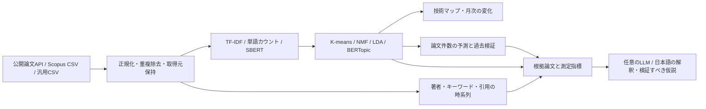

# Research Atlas

公開論文サービスや Scopus の書誌情報・抄録から、研究テーマ、著者のつながり、キーワード、引用の変化を探索するローカルアプリです。Python が分析し、HTML / CSS / JavaScript が表示します。Scopusの契約やAPIキーがなくても、公開サービスから検索して分析できます。

本番PCへの導入とApp Portalからの起動は [導入手順](docs/installation.md) を参照してください。

20,000件ずつの追加と200,000件の多年分析は、[大規模データの検証記録](docs/large-corpus-validation.md) に実測と利用範囲を記載しています。

## 起動

Windows は **`start.bat` をダブルクリック**。初回は Python 3.11 以降が必要で、依存パッケージを仮想環境にインストールします。ブラウザはサーバー起動後に開きます。

```powershell
# 手動起動
python -m venv .venv
.\.venv\Scripts\python.exe -m pip install -r requirements.txt
.\.venv\Scripts\python.exe run.py

# ポートを変更する場合
.\start.ps1 -Port 8001
```

アクセス先は http://127.0.0.1:8000 。サーバーのターミナルで `Ctrl+C` を押すと終了します。

macOS / Linux は `python3 -m venv .venv` → `.venv/bin/python -m pip install -r requirements.txt` → `.venv/bin/python run.py` で起動できます。

## 使い方

1. 初期画面で **合成デモデータ** の分析を確認します。869件の架空論文であり、実際の技術動向ではありません。
2. 「データを追加」→「公開論文を検索」で、取得元、検索語、期間、件数上限を指定します。英語の研究語での検索が基本です。
3. 年別の検索該当数・取得件数・抄録の収録率を確認して分析します。Scopusや他サービスのCSVがあれば「CSVを読み込む」で追加できます。既定期間は当年を除く完了した過去5暦年です。2026年に起動した場合は2021–2025年になります。
4. 技術マップの点、テーマ、著者を選び、根拠論文と抄録を確認します。「月次の兆し」「少ない組み合わせ」から最近の変化と低共起の候補を調べます。
5. 「引用」で累積引用と年別引用を、「将来予測」で論文件数の探索的シナリオと検証誤差を確認します。
6. 「有望領域」で既存分野から探索候補を作り、関連性フィードバック、手元／外部文献の反復探索、根拠の比較を行います。
7. 既存分析は「エクスポート」でJSON・CSV・印刷用HTML、新しい探索評価は「有望領域」内でPDF・CSV・JSONを保存します。

### Scopus CSVを継ぎ足して、多年の論文を分析する

論文CSVは**ファイル容量の固定上限なし・1ファイル20,000行まで**受け付け、重複統合後の1データセットに**最大200,000論文**を保存できます。分析期間は開始年・終了年を含めて最大50年です。CSV内の改行入り抄録は1レコードとして扱います。

1. Scopus等から出力したCSVを、20,000件以内のファイルに分けて用意します。異なる年や検索範囲のファイルも同じデータセットに追加できます。
2. 「データを追加」→「CSVを読み込む」でファイルを選択します。複数ファイルの一括選択・ドロップにも対応しています。
3. 続きを追加する場合は「現在のデータセットに追加する」を選びます。実データが選択されている場合、このチェックは初めから入っています。新しい研究テーマの集合にする場合はチェックを外します。
4. 「読み込み後の操作」を**「保存のみ・CSVを蓄積してから分析する」**にします。複数ファイルを選ぶと、この操作が自動で選ばれます。読み込み済みの件数、重複統合、無効行をファイルごとに確認できます。
5. 追加を続け、揃ったら「分析期間・手法を設定」から対象年とNMF等を指定して分析します。CSV追加直後の期間は、結合したデータの収録年に合わせて更新されます。

例えば、重複のない20,000件のCSVを10回追加すると200,000件になります。重複があれば1論文にまとめるため、単純なファイル件数の合計より少なくなります。途中のファイルでエラーになっても、それ以前に保存できたデータは残り、残りのファイルから再試行できます。再起動後は「保存済み」の対象データセットで「CSVを継ぎ足す（分析せずに開く）」を選ぶと、分析を実行せず追加を再開できます。公開サイトの検索APIによる取得上限は別で、1回1,000件・最大20年のままです。

| 処理 | 対象件数・範囲 |
| --- | --- |
| CSV読み込み | 容量の固定上限なし・1ファイル20,000行まで。複数ファイルは順番に結合 |
| 蓄積と語彙ベースの分析 | 1データセット200,000論文、最大50年。NMF、TF-IDF＋K-means、LDAで利用 |
| 分野・キーワード・引用・年次件数 | 選択期間の全対象論文から集計 |
| 技術マップ・等高線 | 最大400論文の表示用標本。20万点を描画した地図ではありません |
| 論文一覧・原典 | 全対象論文をサーバーで検索し、20件ずつ表示。抄録は選択した論文を個別に読み込み |
| SBERT・旧Transformer・BERTopic | 1回の分析対象は最大20,000論文。対象期間を絞って利用 |
| 「有望領域」のRocchio・LLM評価 | 初期分析の対象は最大10,000論文。期間を絞って再分析してから利用 |

大きな語彙ベースの分析では、分割した学習・推定を使って全対象論文を処理します。小さな集合の一括学習と同じ数値になるとは限りません。各論文のテーマ割り当て、年次集計、引用集計は表示用の400論文に限定しません。処理時間・必要メモリ・保存容量は抄録の長さ、語彙、著者・所属・参照の数、選択したモデル、PCによって変わります。件数上限は処理可能な入力範囲であり、任意のPCでの完了時間や20万件の意味埋め込み分析を保証するものではありません。十分な空きメモリ・ディスクを用意し、実データの一部で処理時間を確認してから蓄積を進めてください。

### 技術ランドスケープの等高線・立体表示

「概要」と「技術マップ」のランドスケープは、論文の配置から計算した密度を、等高線と陰影付きの地形で表示します。「平面／立体」、等高線の表示切り替え、高さのスライダーを使用できます。高さ調整は見た目の強調量を変え、論文や密度値を変更しません。ズーム、論文点の選択、分野タイトルからの総合分析、直近論文の強調も利用できます。

Pythonで**表示中の最大400論文を各1点として**Gaussian KDEを計算し、49×33のグリッドと8段階の等高線を作ります。帯域幅は正規化座標の0.075、最大密度を1とする相対値です。引用数は地形の高さに加重せず、従来どおり点の大きさに使用します。立体表示は、もとの2次元投影に密度の高さを加えた表示です。独立した3次元の意味埋め込みではなく、空白・低い山を分野全体の研究不足、高い山を将来性とは判断できません。

保存済みの分析も再分析せずに表示できます。`GET /api/results/{result_id}/terrain` が保存されたマップから密度を計算し、分析結果やLLM・proxyの設定を書き換えません。

### 有望領域：内容の根拠とRocchio反復探索（v1.6）

「有望領域」タブで評価を作成すると、分類済みの分野ごとに候補、年次件数、根拠の断片、関連論文を表示します。未分類トピックは候補にしません。元の論文分析は保持し、探索・評論の更新ごとに親IDと版番号を持つ別の評価を保存します。保存済みの版を再表示できます。

この反復探索・内容評価は、初期分析の対象10,000論文までです。20万件の全体分析では、まず分野・年次動向・技術マップで対象を見つけ、期間を絞った別の分析で利用してください。全体分析の件数上限と、反復探索の件数上限は異なります。

関連論文に「関連あり」「対象外」「未評価」を指定し、手元の資料だけで並べ直すか、外部APIから追加取得するかを選びます。**関連性と支持・反証は別です。** 性能の悪化や実用化の障害を報告する論文でも、テーマに関連するなら「関連あり」としてください。「対象外」だけがRocchio更新の負例になります。画面のフィードバックは検索との関連性であり、研究成果への賛否ではありません。

NMFマップの分野名から総合分析を開き、「この分野の有望領域を探索」で選択分野を引き継げます。評価画面の「復元リンク」を保存すると、同じPC・データ保存先で、元の分析と評価版を再計算せずに開けます。これはローカル保存を参照するリンクです。保存した版では期間・モデル設定も復元し、不一致や削除されたデータはエラーを表示します。

1回の操作は1〜3ラウンド、外部取得は1ラウンド20〜100件です。候補順位と追加文献が変わらなければ途中で停止します。元の検索語を固定し、累積フィードバックで検索方向を調整します。自動的な擬似関連文献は低い重みの仮判定として履歴に表示し、元テーマからの逸脱と同じ著者への集中を抑制します。推薦順位は検索候補の並び順であり、技術の優劣や成功確率ではありません。

TF-IDFは初期集合の語彙・IDFを固定します。日本語は文字2・3-gramによる語句照合で、形態素解析や同義語の理解ではありません。SBERTを選ぶ場合は、既存の分析画面で準備済みのローカルモデルを使います。探索中にモデルをダウンロードせず、利用できなければエラーを表示します。

二軸表示の横軸は、比較できる場合の**初期入力資料内の観測増減**です。年次件数と分母は初期集合に固定し、追加取得で書き換えません。単一年、上限付き標本、合成・テスト資料、反復取得で資料を追加した評価では成長判定を保留し、候補を別枠に残します。この機能は時系列学習済みの未来予測を実装しておらず、1・3・5年先の数値は出しません。既存の「将来予測」にある最大3年の出版数シナリオとは別の機能です。

縦軸の**根拠言及充足度**は、性能・再現検証・実環境試作・規模製造・耐久安全・費用資源の6項目のうち、実抄録に語句が現れた項目の割合です。実用化の成熟度・TRL・成功確率ではありません。項目ごとの論文数と原文断片を表示し、未取得を未達成とは扱いません。生成・テスト抄録を効果の証拠から除外します。語句・局所的な肯定／否定の検出はヒューリスティックであり、先行研究の紹介か本人の結果か、実際に実験したか、科学的に妥当かは原文確認が必要です。

### 反復探索の取得元とScopus設定

Europe PMC・arXiv・CrossrefはAPIキー不要です。外部探索を選ぶと、元テーマの語、内容から得た更新語、期間、件数上限を選択したサービスへ送ります。各年の関連度上位を取得し、追加取得件数を母集団の増加と解釈しません。実際の検索式・取得日時・年別取得状況・重複統合を履歴に残します。キー未設定でもScopus検索式をコピーして手動検索できます。

初期の公開検索条件がある場合は、その条件と更新した候補語を組み合わせます。通常の語句、引用句、AND/OR、括弧を共通の検索式へ変換し、複数の初期検索は和集合として保持します。未対応のフィールド指定・NOT・ワイルドカードは条件を捨てずにエラーにします。取得後もタイトル・抄録・キーワードで初期条件を照合し、API取得数と探索に採用した数を区別します。同義語・略語・抄録欠測で関連文献を落とす可能性があるため、検索の網羅性は保証しません。CSVなど初期検索条件がない場合は候補語を使い、その制約を履歴に記録します。

Scopus Search APIを使う場合は `.env` に設定して再起動します。

```dotenv
ELSEVIER_API_KEY=あなたのElsevierAPIキー
# 機関の契約で必要な場合のみ
ELSEVIER_INSTTOKEN=
# ELSEVIER_API_KEYが空ならSCOPUS_API_KEYも使用可能
```

キーはサーバー側で保持し、公式APIへ認証ヘッダーで送ります。利用可の表示は設定済みという意味で、契約権限を保証しません。COMPLETEの権限がなければSTANDARDを試し、抄録や著者情報の欠測を明示します。Search APIから実参考文献リストや年別引用履歴を補いません。別サービスの引用値を加算せず、元の計数元を保持して新しい評価へ統合します。合成・テスト評価への実論文の追加はできません。

### 探索の評論とPDF・CSV・JSON

LLMなしでも、数値、根拠断片、定型の支持・反証・次の確認事項を利用できます。任意でローカルLLMまたはOpenAIを選ぶと、**実抄録から構造化した内容を抽出 → 抽出根拠と固定数値から評論**の2段階で生成します。接続方法は後述のLLM設定と共通です。合成・テスト評価はLLMによる効果判定の対象外です。

「解釈の作成方法」が定型の場合は「定型レポートを表示」、LLMの場合は「解釈を生成」を押します。ボタン直下に進捗・完了・失敗理由、その下に本文を表示します。保存済みのLLM失敗理由も再表示します。合成デモではLLMの選択を無効にし、実抄録の取り込みを案内します。候補に利用可能な実抄録がない場合、APIはジョブを作成する前に理由を返し、既存の評価を保持します。

ローカルLLMの応答はストリーミングで受け取り、根拠抽出・評論の各段階の経過時間と受信文字数を表示します。文字数は完了率ではなく、検証前の受信状況です。最初の応答バイトまでは入力の前処理・モデルの読み込みを考慮して最大600秒待ち、受信開始後は無通信180秒で停止します。受信が続く生成を3分で切断せず、各生成段階の全体20分・受信量2MBでも停止します。ローカル向けの根拠抽出は、Pythonが抄録を原文位置付きの抜粋に分け、LLMがそのIDを最大6件選びます（入力は最大12文献、各先頭2400字）。引用文の転記はPythonが行い、原文の書き換えを防ぎます。選択IDを確認して原文位置・数値を検査しますが、要約の意味・否定・因果関係の正しさは専門家未確認のままです。全結果の網羅的評価ではなく、この制約を評論にも記載します。正常な終了通知・完全なJSON・引用原文と根拠IDの確認を経て保存します。数値照合は警告を付ける検査として扱い、トークン上限や通信切断で途切れたJSONは採用しません。

ローカルLLMの抽出出力はIDと分類だけに限定し、原文と説明用ラベルをPythonが補います。評論は支持・反証・条件付き見通し・次の確認事項の4項目です。本文は定性的な説明を基本とし、材料名・測定値などの数字を記載する場合は引用原文や計算済み指標の数値・符号・単位と照合します。数値・符号・単位が一致しない場合も生成文をそのまま保存・表示し、「⚠ 数値照合に失敗・要確認」を付けます。本文上部と該当節に警告を表示し、詳細で照合箇所・数値・単位を確認できます。指定外の根拠IDは引き続きエラーにします。生成用Schemaに文字の正規表現制約を課さず、数値照合は受信後のPythonで行います。支持・反証に根拠IDがない場合、その生成文を捨てて根拠不足を表示します。原文への参照があっても、解釈の正しさや将来予測の妥当性を保証するものではありません。

生成へ渡す論文は最大12件、タイトルは350字、抄録は先頭2,400字までです。OpenAIを選んだ場合の事実抽出は最大32件で、これらの書誌情報・抜粋、候補指標、範囲情報を送信します。原文の連続した引用との一致、根拠ID、認識対象の数値・符号・単位を機械検査し、見出しや注意文も数値検査に含めます。ただし、意味の正しさ、否定範囲、数値の帰属、科学的妥当性を保証する検査ではありません。評論は支持・反証・条件付き見通し・次の研究に分け、数値ブロックを上書きしません。

PDFは保存した版の候補・指標・根拠・評論を表示し、数値照合の警告を表紙・評論・該当箇所に残します。CSV/JSONにも警告状態と対象箇所を保存し、出力時にLLMを呼び直しません。数値照合の警告は文章の虚偽を断定するものではなく、表記差なども含む要確認の印です。過去に破棄された評論本文は復元できないため、旧失敗評価は再生成が必要です。日本語フォントはWindowsのMeiryo等を検出し、必要なら `.env` の `ATLAS_PDF_FONT` に日本語TrueTypeフォントのパスを指定します。CSVはUTF-8 BOM付きのJSON Pointer・値型・値の縦持ち形式で、欠測、改行、論文、各ラウンドを保持します。JSONは評価の構造一式です。LLMや外部取得に失敗した場合も、最後に保存できた評価とその数値を利用できます。

### Scopus CSVの取込について（2026-09-14修正）

CSVを読み込むと、収録された出版年に分析期間を合わせます。別データセットで選んだ年・月次基準月は引き継ぎません。公開検索のデータは検索期間を優先します。

`Author full names` が一部しか埋まっていない場合も、`Authors` と `Author(s) ID` が対応していれば全著者を保持し、明示IDでフルネームを補完します。`[TEST SUMMARY; TITLE-BASED; JA]` はタイトル由来のテスト要約として識別し、文章分析から接頭辞だけを除きます。元抄録は保持し、画面は「合成・テストデータ」と表示します。

提供された `scopus_abstract_results_100.csv` は100件・2025年のみです。NMFマップ、分野比較、著者ネットワーク、CSV出力を確認しています。1年のみの分析では増減率・将来の出版数予測を表示せず、出版月不明の論文は月次比較へ割り当てません。接続できない場合は `start.bat` でサーバーを起動して再読み込みしてください。

### Scopusなしで利用できる取得元

| 取得元 | 主な範囲 | 抄録 | 引用情報 |
| --- | --- | --- | --- |
| Crossref | 全分野の学術メタデータ | 出版社の登録状況に依存。欠測が多い検索もあります | Crossrefに登録された累積被引用数 |
| arXiv | 物理・情報・数学などの理工系プレプリント | 取得可能 | APIに被引用数がないため未取得として表示 |
| Europe PMC | 生命科学・医学を中心とする論文やプレプリント | 収録されている抄録を取得 | Europe PMCの累積被引用数 |
| Scopus CSV / 汎用CSV | ユーザーが出力した書誌データ | CSVに含まれる場合 | CSVに含まれる場合 |

公開3サービスはAPIキーなしで利用します。固定の公式APIへ検索語・年・件数を送信し、公開メタデータを受け取ります。ログインが必要な論文本文は取得しません。APIの一時停止・通信制限はエラーとして表示し、デモデータへ切り替えません。保存済みの同一検索は24時間再利用します。

公式仕様：[Crossref REST API](https://www.crossref.org/documentation/retrieve-metadata/rest-api/)、[arXiv API](https://info.arxiv.org/help/api/user-manual.html)、[Europe PMC RESTful Web Service](https://europepmc.org/RestfulWebService)。arXivの検索期間は初回投稿日、他2サービスは出版日です。arXivの複数リクエストには3秒以上の間隔を設けます。

**検索上限と動向の解釈：** 公開検索は1回20–1,000件、期間は最大20年です。件数を各年へ均等に配分し、その年の関連度上位を取得します。どこかの年で全件を取得できない場合、画面と出力へ「取得標本内の分析」と表示します。これは無作為標本ではありません。表示する件数成長率・予測は取得集合の外挿であり、検索全体・分野全体の成長率ではありません。全件に近づけるには検索式や期間を絞ってください。年別の該当数はサービスが返した検索総数で、取り込んだ抄録の分析件数とは別です。

### 公開論文とScopusの統合

実データを選択した状態で、追加検索またはCSV取り込みの統合オプションを使います。DOI・識別子・タイトルと年で重複を照合し、抄録などの欠測を補完した新しいデータセットを作成します。元のデータセットと過去の分析結果は保持します。異なるDOIが明示された同名論文は、タイトルだけでは統合しません。合成デモと実データの混合はできません。

同じ論文について、別サービスの引用回数を加算したり最大値を選んだりしません。基本は**既存データの取得済み引用値を優先**し、引用値・履歴の双方が欠測の場合は追加データで補完します。取得元ごとの値は `citation_snapshots` に残します。年別引用も異なる取得元の系列を混合しません。複数の計数元が混在した集計は、網羅性が異なるため単純比較できない旨を表示します。

論文の取得元・元ページへのリンク・採用した引用計数元を論文詳細で確認できます。JSON出力には取得日時、検索条件、年別取得状況、取得元別引用値も含まれます。著者名しかないデータは名前で推定照合するため、同姓同名や表記揺れが共著図へ影響します。

### CSVの列

必須列は `Title` と `Year`。UTF-8、UTF-8 BOM、CP932、UTF-16、カンマ・タブ・セミコロン区切りを扱います。引用符付きの改行入り抄録にも対応しています。日本語見出しにも一部対応しています。

| 推奨列 | 用途 |
| --- | --- |
| `EID`, `DOI` | 論文の同定と重複除去 |
| `Authors`, `Author full names`, `Author(s) ID` | 共著ネットワーク。IDがあると表記揺れの影響を減らせます |
| `Abstract` | テーマ・意味表現の抽出 |
| `Author Keywords`, `Index Keywords` | キーワードの頻度・時系列 |
| `Cited by` | 取り込み時点の累積被引用回数 |
| `Source title` | 掲載誌 |
| `Publication date`, `Cover Date`, `Date`, `発行日`, `出版日` | 月次分析用の公開日。`YYYY-MM-DD` または `YYYY-MM` を推奨。`Month` と `Year` の組み合わせにも対応 |
| `Citations 2021`, `Citations 2022`, … | 任意の拡張列。各年に新たに受けた引用数 |

CSVのファイル容量には固定上限を設けません。アップロードは一時ファイルに保存し、文字コードの検証・CSVの読取を順に行います。実際に扱える容量はPCの空きディスク・メモリに依存します。論文CSVは1ファイル20,000行、結合後の保存上限は200,000論文です。無効な行や重複を報告し、空欄の引用数は未知のまま保持します。検索結果の一部のみを出力すると、その部分集合の分析になります。

### 最近数か月の増加と、論文が少ない領域

「データを追加」→「公開論文を検索」で月単位の取得を選び、**最近12か月**を指定すると、最新の完了月までの論文を集められます。月単位は最大24か月で、件数上限を各月に配分します。技術マップの月次画面には、テーマ別のヒートマップと、直近1・3・6か月をその直前の同じ長さの期間と比べた件数・構成比の変化を表示します。基準月と比較月数は分析設定でも変更できます。当月は未完了のため比較しません。

「増加候補」は直近3件以上、比較期より2件以上増え、件数増加率と取り込み集合内の構成比差がともに正のテーマです。「新規観測候補」は比較期0件・直近3件以上で、率を無限大とは表示しません。便宜的な探索条件であり、統計的有意差の判定ではありません。比較期間が未取得、全体件数が0、または出版月不明なら増加判定を保留します。CSVは収集した月の範囲を確認できないため、利用者による収集範囲の確認が必要です。

**年だけのデータから月は復元しません。** 既存の合成デモや日付のない保存データでは月次分析はできません。日付付きCSVを読み込むか、公開APIから再取得してください。日付の取得率と除外件数を表示し、不正日付・出版年と矛盾する日付は月次集計に使いません。Europe PMCは初回出版日、arXivは初回投稿日、Crossrefは登録された出版日であり、定義や登録の遅れが異なります。Europe PMCが欠測月日を補完している場合もあるため、APIの日付があっても原典の精度を確認したことにはなりません。

「少ない組み合わせ」は、全対象論文のタイトル・抄録・キーワードで、個別には出現するが同一論文では現れにくい語の組み合わせを抽出します。各語3文献以上、独立仮定の参考件数 `nA × nB / N` が2以上、実際の共起が2件以下かつ参考件数の半分未満を条件とし、最大12候補を表示します。各語・両語を含む根拠論文へ進めます。同義語や表記差、別分野の語、抄録欠測でも低共起になるため、候補の意味は原文で確認してください。

**t-SNEの地図上の空白や点の密度は研究空白の証拠にはしません。** 低共起は取得集合内の観測であり、未研究・実現可能・有望という認定ではありません。また公開検索の上限で抽出した標本では、月ごとの取得件数は上限に影響されます。分野全体の増加を調べるには、同じ検索条件で各比較期間を網羅する資料が必要です。JSONには月次集計・低共起候補・根拠ID、CSVには月次テーマ指標、HTMLレポートには両方の集計と限界を保存します。

### 共著ネットワークを名前・ID・大学で分類

「著者」画面の分類基準を切り替えると、元の論文分析をやり直さずに共著ネットワークを再構成します。

| 分類基準 | 表示するまとまり |
| --- | --- |
| 著者ID | 著者IDと明示的な別名IDで照合した研究者ごとの表示 |
| 著者名（一致候補） | 正規化した名前が一致するグループ。同名でも異なる明示IDは別の点として保持 |
| 大学・所属機関 | 著者に紐づいた所属。複数所属は論文への出現数が最多の機関を主表示に使用 |
| 共著コミュニティ | 共著論文数を重みにしたネットワークから抽出したまとまり |
| 研究分野 | 著者の論文で最多の研究トピック |

著者ID・別表記・所属・根拠論文は研究者の詳細から確認できます。名前だけによる照合は推定で、同一人物の認定ではありません。IDがない場合に名前が一致しても、対応する明示IDが複数ある場合は特定の人物へ統合しません。ID付きの所属情報が一致しない場合も、同姓同名の別人に転記しません。

大学の表示は、**著者本人に対応付けられた所属情報**を使います。論文全体に書かれた所属一覧を全著者に割り当てることはありません。所属が不明なら「所属未取得」と表示します。機関名の表記を正規化し、原文も保持しますが、略称・英訳・大学統合・キャンパスの違いを網羅する名寄せ辞書ではありません。所属がない古い保存データは、対応付き所属を含むCSVや公開APIから補完してください。

表示は論文数上位120著者・240本の共著辺です。コミュニティ計算には表示120著者間の全共著辺を使います。全研究者のコミュニティを推定したものではありません。著者の論文数・所属は全対象論文から集計し、同じ論文に同一人物の別表記が複数あっても1件として数えます。

CSV取り込みでは、`Author(s) ID` と `Author affiliations` を利用できます。例えば `Author affiliations` のセルに `[ {"id":"scopus:123","name":"Example Author","affiliations":["Example University"]} ]` のようなJSONを入れると、該当IDの著者に所属を対応付けられます。`Affiliations` 列だけでは論文単位の所属となり、著者別の大学分類には使いません。CSVの列対応を確認する合成テスト例は `tests/fixtures/scopus_partial_full_names.csv` にあります。

CSVは「著者」「共著関係」「クラスタ」の3種類です。著者CSVは表示外も含む全照合済み著者、共著CSVは表示120著者間の全共著辺、クラスタCSVは表示集団のグループを出力します。表示外の研究者はコミュニティが未計算です。各CSVに根拠論文ID・分類方法・集計範囲を保持します。

### 分野名をクリックして総合分析

技術マップの分野タイトル・凡例・分野カードをクリックすると、**分野の総合分析**が開きます。論文の点をクリックした場合は従来どおり論文詳細が開きます。分野分析はLLMなしでも計算・レポート生成できます。

- **出版動向**: 対象分野と比較先の発行年別件数を折線／棒グラフで表示します。投稿・提出日は収録していないため、投稿件数ではありません。
- **隣接領域**: 新しいNMF分析では、全対象論文の正規化した文書–テーマ重みを群内で平均し、重心間のcosine類似度で候補を選びます。正の類似度がある最上位候補を初期比較にし、比較先を切り替えられます。古い保存結果や他方式では、代表語のJaccard類似度と明記します。2次元地図の見た目の距離は判定に使いません。
- **著者のつながり**: 共通著者と、この取得集合で対象分野／隣接分野に最初に現れた年を表示します。同年は方向を付けません。名前だけの照合は推定です。研究分野の移動、所属移籍、技術移転を実証した値ではありません。
- **所属と手法**: 実際に収録した所属機関を論文単位で比較し、取得率を表示します。手法は固定語彙に一致した抄録中の言及を数え、根拠の抜粋を保持します。否定・先行研究の紹介・略語の別義も含みうるため、実施した実験方法の認定ではありません。
- **影響関係の根拠**: 両分野のNMF重みが各0.1以上の論文を橋渡し候補にします。分野間の引用矢印は、参考文献中のDOI・標準IDと取り込み済み論文が実際に照合できる場合のみ表示します。引用数や意味類似性から引用関係を補いません。
- **見通しとレポート**: 既存の最大3年の論文件数シナリオ、検証誤差、観測の整理を表示します。LLM接続後は、同じ数値と限定した根拠論文から追加の解釈・仮説を生成できます。

CSVはダイアログ内の3つのボタンから出力します。**レポートCSV**は文章・生成方式・モデル名・根拠ID・限界、**分析データCSV**は年別／予測の縦持ち表と全比較指標、**根拠論文CSV**は比較2分野の全対象論文・全抄録・著者・所属・参照・NMF重みを含みます。分析データの `detail` 行はJSON Pointer形式のパスと値の型で階層を保持し、空欄の欠測と0を区別します。画面の表示上限を超える集計行も `export_data` 以下に残します。

所属を追加するCSV列は `Affiliations` / `所属`。複数機関はセミコロン区切りです。著者別の対応が明示された `Authors with affiliations` や `Author affiliations`（JSON）も扱います。`References` / `Reference DOIs` には参考文献の実DOI・標準IDを指定できます。識別できない自由文や参考文献の有無だけから引用矢印は作りません。公開サービスも収録している情報だけを取得します。**旧保存データには新しい所属・参照情報が自動では追加されません**。必要な場合はCSVを再取り込み、または公開検索から再取得してください。過去の結果は保持します。

### ローカルLLMで総合レポートを深める

このアプリはLLM本体を自動インストールしません。Ollamaでローカルモデルを用意して起動するか、LM Studioで構造化出力に対応するローカルモデルを読み込み、APIサーバーを起動します。「分析設定」→「LLM・プロキシ接続を設定」で、Ollamaの場合は方式を `ollama`、URLを `http://127.0.0.1:11434` にして、インストール済みモデル名を入力します。

LM Studio等の場合は方式を `openai_compatible`、URLを `http://127.0.0.1:1234/v1` とします。認証が必要なサーバーではローカルAPIキーも入力します。モデル名を空欄にした場合は取得した一覧から選べます。このブラウザに保存した後、再起動せずに総合分析画面でモデルを選んで「ローカルLLMで解釈」を実行できます。

接続先はループバックアドレスに限ります。Ollamaでクラウド転送と判別できるモデルは使用しません。互換API側も、利用者がローカル推論するサーバーとして構成してください。ローカルモデルが未起動・未導入なら数値ベースのレポートを利用できます。生成失敗時も数値レポートとCSVは保存されます。

OpenAIを使う場合は接続設定でAPIキーとモデル名を保存し、総合分析画面で明示的にOpenAI生成を選びます。集計指標、比較に必要な所属・著者情報、各分野最大8件のタイトルと抄録先頭1400字を送信します。応答形式と参照IDを検証し、LLMが数値分析を上書きすることはありません。生成文章の事実性は原文との照合が必要です。

接続仕様：[Ollamaの構造化出力](https://docs.ollama.com/capabilities/structured-outputs)、[LM Studioの構造化出力](https://lmstudio.ai/docs/developer/openai-compat/structured-output)、[OpenAIの構造化出力](https://developers.openai.com/api/docs/guides/structured-outputs)。

### 年別の引用履歴

**通常の `Cited by` だけでは過去の引用推移を復元できません。** このアプリも累積値を年別に分配しません。年別の受領引用は、上記の拡張列か、別途準備した次のCSVで追加します。

```csv
EID,Year,Citations
2-s2.0-対象論文のEID,2024,5
2-s2.0-対象論文のEID,2025,12
```

`EID` の代わりに `DOI` でも照合できます。「データを追加」→「年別引用履歴」で読み込みます。`Year` は引用を受けた年、`Citations` はその年の新規引用数です。累積引用と同じデータベースの値を指定してください。記録のない年は省略し、実測0件の場合だけ `0` と記載してください。履歴の追加は新しいデータセットとして保存し、過去の分析を維持します。

Scopus の [Citation Overview API](https://dev.elsevier.com/documentation/AbstractCitationAPI.wadl) は年別の引用件数を返すインターフェースです。年別引用履歴はCSV入力方式で、このAPIからの直接取得は実装していません。「有望領域」のScopus Search APIによる文献検索とは別です。画面の「引用履歴の書式」は本アプリ用の正規化形式です。Scopus独自のCitation Overview出力を使う場合は、EID / Year / Citationsに整形してください。

## SBERT・トピックモデルとLLM

機械学習で観測値を構造化し、LLMで仮説を言語化する構成です。



### モデルの選択

「分析設定」で**テーマ抽出方法**と**文章表現**を選び、「設定を適用して分析」を押します。同じデータを別の方式で分析し直せます。設定と実際のモデルIDは分析結果に保存されます。

| テーマ抽出方法 | 入力・特徴 | マップに使う表現 |
| --- | --- | --- |
| K-means | TF-IDFまたはSBERTの近さで、指定した数の群に分類 | 選択したTF-IDF／SBERT |
| NMF | TF-IDFを非負値行列分解し、テーマを構成する語を抽出 | 正規化した文書–テーマ重み |
| LDA | 単語の整数出現回数から、文書内のテーマの混合を推定 | 文書–テーマ確率分布 |
| BERTopic | SBERT → UMAP → HDBSCANで群を検出し、c-TF-IDFで代表語を抽出 | 元のSBERT埋め込み |

NMFとLDAは通常のインストールで利用できます。LDA選択時は語彙ベースの入力に固定されますが、**学習にはTF-IDF値を使わず、単語カウントを作り直します**。NMF/LDAの論文件数・月次推移は、各論文で最も強いテーマへの単一割り当てを集計します。NMFの重みやLDAの所属確率は分類の正解確率ではありません。

NMF・LDA・TF-IDF＋K-meansは最大200,000論文を対象にできます。SBERTを使うK-means、旧Transformer表現、BERTopicは最大20,000論文です。語彙ベースの大規模処理ではNMFとK-meansはミニバッチ、LDAはオンライン学習を使い、全件の割り当てと集計を行います。使用した推定器と処理方式は結果のモデル情報に残します。

BERTopicには以下の追加環境が必要です（SBERTの依存も含みます）。今回の環境には導入済みです。

```powershell
.\.venv\Scripts\python.exe -m pip install -r requirements-topics.txt
```

BERTopicの「テーマ数」は検出後の縮約目標で、実際の検出数は指定値と異なることがあります。「最小テーマ件数」を大きくすると小さな群が残りにくくなります。十分まとまらない論文は**未分類**として保持し、地図では灰色で表示します。全件数・論文一覧には残し、注目ランキング・テーマ予測・月次増加候補から除きます。データ不足や空の語彙でも別方式に自動切り替えません。

参考：[scikit-learnの分解モデル](https://scikit-learn.org/stable/modules/decomposition.html)、[BERTopicの構成](https://maartengr.github.io/BERTopic/algorithm/algorithm.html)。

### Sentence-BERT（SBERT）

SBERTはSentence Transformersライブラリで利用する文章埋め込みモデル群です。画面で以下の実モデルを切り替えられます。

- **SBERT MPNet（英語）**: `sentence-transformers/all-mpnet-base-v2`。新しいSBERT設定の既定値。
- **多言語 MiniLM**: `sentence-transformers/paraphrase-multilingual-MiniLM-L12-v2`。日本語を含む文書向け。

SBERTのみを追加する場合：

```powershell
.\.venv\Scripts\python.exe -m pip install -r requirements-transformer.txt
```

Windowsでは動作確認したCPU版のPyTorch 2.8.0を使用します。検証環境はWindows / Python 3.13です。この環境の全依存バージョンは `requirements-lock-windows.txt` に記録しています。

サーバーを再起動し「分析設定」でSBERTを選びます。最初の実行では選択したモデルをダウンロードし、以後はキャッシュを使ってCPUで推論します。TF-IDFへの無断フォールバックは行いません。モデルの読込失敗は画面で通知します。

長い抄録はモデルのトークン長に合わせて分割し、窓ごとのベクトルをトークン数で加重平均します。32,000文字・12窓／論文を超える場合は先頭末尾を含む分散抽出にし、警告と処理件数を記録します。分析全体は40,000窓が上限です。

旧APIの `embedding=transformer` は互換性のため残し、従来の `.env` の `ATLAS_EMBEDDING_MODEL`（未指定なら多言語MiniLM）を使います。新しい `embedding=sbert` は保存したプリセットを使用し、環境変数で別モデルに変更されません。[Sentence Transformers公式](https://sbert.net/docs/sentence_transformer/usage/usage.html)、[MPNetモデル仕様](https://huggingface.co/sentence-transformers/all-mpnet-base-v2)。

語彙ベースのNMF/LDAには日本語の形態素解析を追加していません。分かち書きのない日本語文書では、多言語SBERTとK-means／BERTopicを検討してください。埋め込みが意味の近さを扱っても、「少ない組み合わせ」の語句照合は同義語を自動統合しません。

### LLM・proxyのブラウザ保存（v1.7）

「分析設定」→「LLM・プロキシ接続を設定」で、OpenAI APIキー・モデル名、ローカルLLMの方式・URL・モデル・任意APIキー、HTTP(S) proxyのURL・ユーザー名・パスワード・除外先を設定し、「このブラウザに保存」を押します。再読み込み後も保持され、次の通信から反映します。設定だけの変更で論文分析を再実行しません。

保存先はこのサイトの `localStorage`（`research-atlas.connections.v1`）です。ブラウザのプロファイル・サイトのオリジンごとに保存されます。例えば `localhost` と `127.0.0.1`、異なるポートは別設定です。同じオリジンの別タブは保存・削除を反映します。これはブラウザ内の平文保存で、画面上のAPIキー・パスワードは伏字にします。「保存済み設定を削除」で消去でき、保存できない環境ではエラーを表示します。

接続設定は同一オリジンの `/api/` リクエストにだけ付けてローカルPythonへ渡し、リクエスト／実行ジョブのメモリ内で使用します。バックグラウンド探索や評論は開始時の設定を維持します。認証情報は分析結果・ジョブ情報・出力ファイル・`.env` に保存しません。LLMとproxyは環境変数へフォールバックしないため、旧 `.env` のLLM設定を利用していた場合は画面に入力してください。ScopusのAPIキー等、他のサーバー設定は従来どおりです。

ProxyはOpenAIと公開論文サービス・Scopusの取得に適用します。認証は任意のユーザー名／パスワード方式です。除外先はカンマ区切りのホスト・ドメイン・IP/CIDR・任意ポートを指定でき、ローカルLLMは常に直接接続します。OSのproxy設定はこれらの通信へ引き継ぎません。埋め込みモデルのダウンロード設定は対象外です。

接続確認は入力中の設定を使い、保存はしません。OpenAIは[指定モデルの情報取得](https://developers.openai.com/api/reference/cli/resources/models/methods/retrieve)、ローカルLLMはモデル一覧、proxyはCrossrefへの到達を確認します。接続確認では論文を送信せず、文章生成もしません。

OpenAIにはResponses APIとStructured Outputsに対応したモデルを指定してください。モデルIDは固定していません。画面で明示的にLLM生成を選んだ時だけ、集計指標と選択された論文のタイトル・抄録の抜粋をOpenAIへ送信します。`store=False` を指定し、JSONの出力形式を検証します。選択資料にない根拠論文IDを返した場合は回答を採用しません。[Structured Outputsの公式仕様](https://developers.openai.com/api/docs/guides/structured-outputs)

既定のインサイトは**ローカルの定型解釈**です。LLM未設定でも全ての数値分析が動きます。LLMの出力は観測・仮説・限界に分け、数値予測を上書きしません。論文を使った追加学習や自動ファインチューニングは行いません。

## 分析の意味

| 機能 | 実装と読み方 |
| --- | --- |
| テーマ | K-means・NMF・LDA・BERTopicから選択。各方式の代表語を表示し、未分類は別集計 |
| 技術マップ | 最大400論文を抽出し、必要時にSVD圧縮してt-SNEで2次元へ配置。少数・同一文書の場合は線形投影。点は論文、線は選択した文章表現／テーマ分布の類似。引用関係の線ではありません |
| 共著者 | 実際に同じ論文へ記載された著者の共著数。著者IDがない場合は名前による推定照合 |
| キーワード | 論文単位の出現頻度。著者キーワード欠測時はTF-IDF語を使用 |
| 引用 | 出版年ごとの累積引用と、引用受領年ごとの新規引用を区別。年別履歴のカバー率も表示 |
| 注目度 | 論文件数の伸びと直近シェアを基本とする0–100の探索スコア。比較可能な同一論文群の年間引用増減があれば25%加重。なければ累積引用÷経過年の代理成分を15%加重 |
| 新興候補 | 平滑化成長率25%以上、直近3件以上、取り込み集合内のシェア上昇0.5ポイント超 |
| 予測 | 年間論文件数の減衰付きlog線形回帰、最大3年。過去検証で前年維持の方が低誤差なら前年維持を採用 |
| 検証 | 最初の3年以降、翌年を順に予測してMAEを比較。5年データなら通常2検証点 |
| 有望領域 | Rocchio反復検索、初期集合内の記述、6項目の根拠言及、任意LLM評論。内容による将来予測・TRL認定・成功確率は未実装 |

技術マップは最大400論文、共著図は上位120著者・240辺を表示します。著者ごとの件数は全対象論文から集計し、共著クラスタは表示著者間の全辺から計算します。技術マップは局所的な近隣関係を読むための図で、離れた群の距離・位置・面積は定量比較できません。軸に物理単位はありません。

成長率はトピック／キーワードの場合、直近2年とその前の2年の年平均件数差を「前期平均+1」で割る平滑化率です。期間が短ければ各1年で比較します。全体KPIの前年比は通常の最終年対前年です。

**予測は技術の発明・実用化・成功確率の予言ではありません。** 帯は校正された信頼区間ではなく、探索的なシナリオ範囲です。テーマ抽出には全対象年の抄録を使うため、検証は「回顧的に定義したテーマの件数予測」であり、未知のトピックを過去時点で発見できたことを証明するものではありません。現在の累積引用は論文件数予測・その検証に使いません。検索式の偏り、データ欠測、出版・引用の遅れ、分野差、自己引用を含む影響も残ります。

実運用で精度を確かめる場合は、検索条件と収集日時を固定した複数年スナップショットを保存し、各時点までの抄録のみでテーマ抽出をやり直した検証を追加してください。LLMの仮説は、後年の論文や実験で別途評価する必要があります。

## 保存・API・開発

- データセットと結果は `data/` に保存します。小さな集合はJSON、大きな集合はJSONの管理情報とSQLite等の補助ファイルを組み合わせます。`.env`、`data/`、仮想環境はGit対象外です。
- バックアップ・PC移行時は**アプリを停止してから `data/` フォルダ全体をコピー**してください。大規模データのSQLite・補助ファイルを含める必要があり、JSONだけのコピーでは復元できません。`ATLAS_DATA_DIR` を指定している場合は、その保存先全体が対象です。LLM・proxyの設定はブラウザ保存のため、このバックアップには含まれません。
- `http://127.0.0.1:8000/docs` にAPI仕様があります。
- バックエンドはFastAPI。重い分析は単一ワーカーへ投入し、画面で進捗を取得します。
- フロントエンドにビルド処理や外部CDNは不要です。

```powershell
.\.venv\Scripts\python.exe -m pytest -q
node --test tests/test_csv_ui.mjs tests/test_large_corpus_ui.mjs tests/test_foresight_ui.mjs tests/test_restore_ui.mjs tests/test_connection_settings_ui.mjs
```

取り込み・数値分析・API連携・エクスポート・LLM境界をテストします。テスト中に有料APIを呼びません。LLM SDKはモックで検証します。

| ファイル | 役割 |
| --- | --- |
| `app/ingest.py` | CSV正規化、重複除去、引用履歴、合成デモ |
| `app/sources.py` | Europe PMC・arXiv・Crossrefの公式API検索 |
| `app/merge.py` | 取得元を保持したデータ統合・引用値の出典分離 |
| `app/analytics.py` | トピック、地図、ネットワーク、スコア、予測 |
| `app/topic_models.py` | NMF・LDA・BERTopic、未分類・情報不足の扱い |
| `app/embedding_models.py` | SBERTモデルのプリセットと旧設定の互換処理 |
| `app/field_analysis.py` | 分野・隣接領域の比較指標、著者順序、所属・手法・参照の根拠 |
| `app/field_llm.py` | 総合レポートの定型文章、Ollama／互換API／OpenAIの任意解釈 |
| `app/author_network.py` | 著者の照合、名前・ID・大学・共著・テーマ別クラスタ |
| `app/author_exports.py` | 著者・共著関係・クラスタのCSV出力 |
| `app/field_exports.py` | 総合レポート・分析指標・全対象論文のCSV出力 |
| `app/foresight.py` | 不変の初期集合、Rocchio更新、内容断片と記述指標 |
| `app/foresight_api.py` | 探索・評論ジョブ、評価の別版保存、履歴・出力API |
| `app/foresight_sources.py` | 元テーマを保持した再検索、公開3サービスとScopus Search API |
| `app/foresight_llm.py` | 任意の2段階内容抽出・評論、原文・ID・数値の検査 |
| `app/foresight_exports.py` | 保存した評価版のCSV・日本語PDF出力 |
| `app/bibliography.py` | 所属と実参考文献の正規化 |
| `app/frontiers.py` | 月次比較、低共起の組み合わせ、根拠論文 |
| `app/dates.py` | 公開日の正規化・精度保持・補完 |
| `app/main.py` | API・分析ジョブ・ローカルHTTPサービス |
| `app/insights.py` | 根拠を限定した任意LLM連携 |
| `app/reports.py` | JSON・CSV・HTML出力 |
| `app/storage.py` | ローカル保存とデータセット管理 |
| `app/large_storage.py` | 大規模集合のSQLite保存、論文検索・ページ取得 |
| `app/limits.py` | CSV・蓄積・期間・画面取得の件数上限 |
| `static/` | ダッシュボード |
