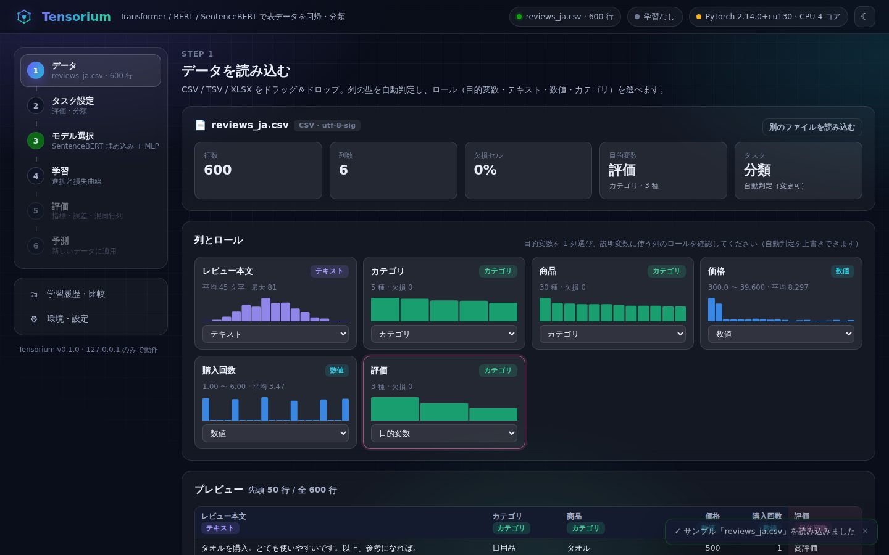
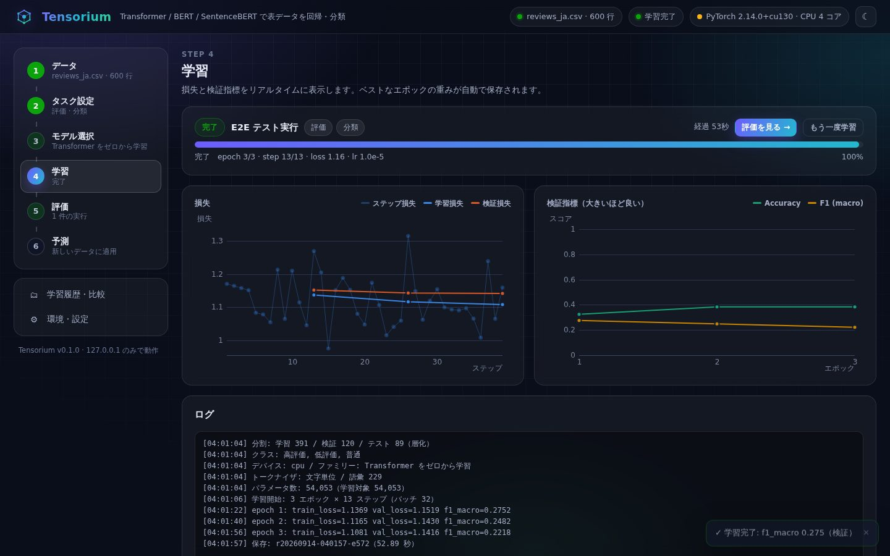

# Tensorium — Transformer / BERT / SentenceBERT で表データを回帰・分類する GUI スタジオ

CSV / XLSX を放り込むだけで、**Transformer 系ニューラルネットによる回帰・分類**を
ブラウザの 6 ステップで実行できるローカル Web アプリ。

```bash
python tensorium/server.py            # http://127.0.0.1:8740
python tensorium/server.py --port 9300 --open
```

- サーバは **標準ライブラリのみ**（pip install 不要）。**127.0.0.1 のみ**に bind し外部公開しない
- 学習には **PyTorch**（＋ BERT 系を使うなら **transformers** / **sentence-transformers**）が必要。
  無くても データ確認・ベースライン・環境診断 は動く
- モデルは Hugging Face Hub からダウンロード、または **ローカルフォルダを指定**（オフライン環境可）
- [App Portal](../launcher/) にも登録済み（カード「Tensorium」）

<p align="center">
  
  
</p>

## 6 ステップ

| ステップ | できること |
|---|---|
| **1. データ** | CSV / TSV / XLSX をドラッグ＆ドロップ（UTF-8 / Shift_JIS 自動判別、XLSX はシート切替可、300MB まで）。列ごとに **数値 / カテゴリ / テキスト / 日時 / ID** を自動判定し、分布のミニチャートとともに表示。各列の **ロール**（目的変数・テキスト・数値・カテゴリ・使わない）をその場で変更 |
| **2. タスク設定** | 目的変数と **回帰 / 分類** の切替（自動判定つき）、学習 / 検証 / テストの分割比率・乱数シード・層化分割、目的変数の分布チャート、行数の警告 |
| **3. モデル選択** | 5 つの **モデルファミリー**（下表）から選び、事前学習モデルはカタログ（日本語 / 多言語 / 英語）またはモデル ID / ローカルパスを指定。ハイパーパラメータは基本 / 詳細の 2 段階フォーム。学習ステップ数の見積り表示 |
| **4. 学習** | 進捗バー・ETA・ステップ損失 / エポック損失 / 検証指標の **リアルタイム曲線**・ログ。**早期終了**でベストエポックの重みを保存。いつでも中止 |
| **5. 評価** | 検証 / テストの指標タイル（回帰: RMSE / MAE / R² / MAPE / Pearson r、分類: Accuracy / F1 / Precision / Recall / Log loss / ROC-AUC）、**実測 vs 予測の散布図**・残差分布、**混同行列**・クラス別指標、誤差の大きい例（元ファイルの行番号つき） |
| **6. 予測** | 学習済みモデルを **新しい CSV / XLSX に一括適用**して CSV ダウンロード（実測列があれば精度も表示）、または 1 件を **手入力**して予測（分類はクラス確率バー） |

さらに **データ拡張（LLM 知識蒸留）**（下記）、**学習履歴・比較**（全実行の一覧・名前編集・削除・代表指標の比較チャート）と
**環境・設定**（ライブラリ / GPU の診断、インストールコマンド、プロキシ・HF ミラー・オフライン・キャッシュ先・デバイス）。

## データ拡張 — LLM 知識蒸留で偏りを均衡化する

目的変数が偏っている（少数クラスが極端に少ない）と、モデルは多数クラスばかり予測しがちになります。
サイドバーの **データ拡張（LLM 蒸留）** タブでは、教師 LLM に元データの傾向を学ばせて少数グループの
合成データを生成し、検証してから **学習データにのみ** 追加できます（検証 / テストには一切混ぜないので、
評価は実データだけで行われます）。

1. **現在の分布**: クラス（回帰なら目的変数の分位ビン）ごとの件数、最大 / 最小比、均衡度（正規化エントロピー）
2. **生成計画**: 生成件数を 100 / 200 / 500 / 1000 / 2000 またはカスタムで選び、配分方式
   （**均衡化** = 不足分に比例、**均等**、**グループ別指定**）を選ぶと、「実データ + 合成データ」の
   積み上げチャートと均衡度の変化（例: 54% → 94%）が即座に更新される
3. **元データの学習**: グループごとに実例（few-shot）・数値列の範囲と平均・カテゴリの分布・
   文字数・特徴的な語をプロファイルし、プロンプトに埋め込む
4. **教師 LLM による生成**: OpenAI 互換 API（OpenAI / Azure 互換 / Ollama / LM Studio / vLLM）または
   Anthropic Messages API に JSON で行を生成させる。並列数・1 回の件数・temperature・追加指示を指定可
5. **検証（蒸留の裏取り）**: 列の妥当性と数値範囲、実データ / 生成済みとの近似重複の除去、
   **教師 LLM の再ラベリング**（一致した行のみ採用）、**学習済み生徒モデルの予測照合**（不一致は除外 / フラグ）
6. **学習へ**: 「学習データに含める」を ON にしてモデル選択へ進むと、学習データにだけ合成行が追加される。
   評価画面と履歴には「⚗ 合成 N 行を学習に使用」と表示され、拡張前後の精度を比較できる。
   合成のみ / 拡張後の CSV もダウンロード可

LLM が使えない環境でも **内蔵生成**（実データの文の組み替えと統計からのサンプリング。LLM なし）で
一連の流れを確認できます。LLM の接続設定（プロバイダ・Base URL・モデル・API キー）はタブ内で保存し、
「接続テスト」で疎通を確認できます。API キーは `tensorium.config.json` に保存され、画面には返しません。

## モデルファミリー

| ファミリー | 中身 | 向いている場面 | 追加ライブラリ |
|---|---|---|---|
| **Transformer ファインチューニング** | BERT / RoBERTa / DeBERTa / E5 などの事前学習モデル全体を微調整。`[CLS]` または平均プーリング → ヘッド。数値・カテゴリ列は **融合ヘッド**で結合 | 精度最優先。GPU がある | torch, transformers |
| **SentenceBERT 埋め込み + MLP** | 文埋め込みを一度だけ計算（凍結）し、その上に MLP を学習。sentence-transformers が無ければ transformers の平均プーリングで代替 | **CPU でも速い**、少データでも安定。まず試すならこれ | torch, transformers（sentence-transformers 任意） |
| **Transformer をゼロから学習** | 学習データから文字 / 単語トークナイザを作り、小さな Pre-LN Transformer エンコーダを学習 | **ダウンロード不要・完全オフライン**。専門用語・記号中心のテキスト | torch |
| **FT-Transformer（表形式）** | 各列を 1 トークンに埋め込み、自己注意で列間の相互作用を学習（Gorishniy et al. 2021 の方式） | テキストが無い / 数値・カテゴリ中心 | torch |
| **ベースライン** | 平均値 / 最頻値を常に予測 | 他モデルの指標を解釈する物差し | なし |

どのファミリーでも、テキスト列は複数指定可（`列名: 値` の形で連結）、数値列は標準化＋欠損補完、
カテゴリ列は埋め込み（未知値は UNK）で扱う。回帰の目的変数は標準化して学習し、指標は元スケールで計算する。

### 事前学習モデルのカタログ（抜粋）

| 言語 | モデル | 備考 |
|---|---|---|
| 日本語 | `tohoku-nlp/bert-base-japanese-v3` | 定番。`pip install fugashi unidic-lite` |
| 日本語 | `cl-nagoya/ruri-v3-30m` / `ruri-v3-130m` | 軽量〜高精度の文埋め込み |
| 日本語 | `ku-nlp/deberta-v2-base-japanese` | 高精度。`pip install sentencepiece` |
| 多言語 | `intfloat/multilingual-e5-small` / `base` / `large` | 追加ライブラリ不要。日本語も可 |
| 多言語 | `sentence-transformers/paraphrase-multilingual-MiniLM-L12-v2` | 軽量な SentenceBERT |
| 多言語 | `FacebookAI/xlm-roberta-base` / `microsoft/mdeberta-v3-base` | ファインチューニング向け |
| 英語 | `google-bert/bert-base-uncased` / `FacebookAI/roberta-base` / `microsoft/deberta-v3-base` | |
| 英語 | `sentence-transformers/all-MiniLM-L6-v2` / `all-mpnet-base-v2` | |

カタログ外でも Hugging Face のモデル ID、または `save_pretrained` 済みフォルダのパスを入力すれば
`AutoModel` / `AutoTokenizer` で読み込む。

## セットアップ

```bash
# 1) 学習エンジン（GPU なしの PC）
pip install torch --index-url https://download.pytorch.org/whl/cpu
# 1') NVIDIA GPU あり
pip install torch

# 2) BERT 系 / SentenceBERT / XLSX（openpyxl は任意。無くても内蔵 XLSX リーダーで読める）
pip install transformers sentence-transformers openpyxl

# 3) 使うモデルに応じて
pip install fugashi unidic-lite      # 日本語 BERT（東北大 v3 系）
pip install sentencepiece            # DeBERTa / LUKE / GLuCoSE 等

# 起動
python tensorium/server.py --open
```

「環境・設定」タブに同じコマンドがコピー用に並び、各ライブラリの有無・GPU も表示される。

### 社内プロキシ・オフライン環境

- **プロキシ**: 環境変数 `HTTPS_PROXY` を使う。設定画面で個別の URL 指定や無効化も可能
- **HF ミラー**: 設定の「HF エンドポイント」に社内ミラーの URL
- **完全オフライン**: 別 PC で `AutoModel.from_pretrained(id).save_pretrained("フォルダ")`
  （トークナイザも同様）して持ち込み、モデル ID 欄に **フォルダのパス**を入力。
  設定で「オフライン」を ON にすれば Hub へ一切接続しない
- 「Transformer をゼロから学習」「FT-Transformer」「ベースライン」はダウンロード不要

## サンプルデータ

`sample_data/` に 3 つ同梱（画面の「サンプルデータで試す」から読める。生成スクリプトは `make_samples.py`）。

| ファイル | タスク | 内容 |
|---|---|---|
| `reviews_ja.csv` | 分類 | 商品レビュー本文＋カテゴリ・価格 → 高評価 / 普通 / 低評価（600 行） |
| `used_cars_ja.csv` | 回帰 | 中古車の説明文＋年式・走行距離など → 価格（万円）（520 行） |
| `sales_memo_ja.xlsx` | 分類 | 営業の商談メモ＋提案金額・商談回数 → 受注 / 失注 / 継続（420 行、日付列あり） |

「ゼロから学習」なら CPU で数秒〜数十秒、レビュー分類で検証 F1 ≈ 0.9 程度が出る。

## 保存されるもの

- `tensorium/data/runs/<run_id>/`: `meta.json`（設定・指標・曲線・評価用サンプル）、`preproc.json`（エンコーダ）、
  `arch.json`、重み（`model.pt` / ファインチューニングは `encoder/` に `save_pretrained` + `head.pt`）
- 保存先は環境変数 `TENSORIUM_DATA_DIR` で変更可
- `tensorium.config.json`: 設定（HF トークンを含むためコミット禁止・.gitignore 済み）

## API（フロントエンドが使うもの）

| メソッド | パス | 内容 |
|---|---|---|
| POST | `/api/dataset/upload` | 本文 = ファイル、`X-Filename`（URL エンコード）、任意 `X-Sheet` → 列解析つきサマリ |
| POST | `/api/dataset/sample` / `sheet` / `clear` | サンプル読込 / シート切替 / 破棄 |
| POST | `/api/spec/validate` | 目的変数・ロール・分割の検証と目的変数の分布 |
| GET | `/api/catalog` / `/api/env` / `/api/samples` / `/api/status` | カタログ / 環境診断 / サンプル一覧 / 状態 |
| POST | `/api/train` | `{spec, family, model, hparams, name, use_synthetic}` → `job_id`（同時実行は 1 本） |
| GET | `/api/jobs/<id>?log_from=N` | 進捗・曲線・ログ（ポーリング） / POST `/cancel` で中止 |
| GET | `/api/runs` / `/api/runs/<id>` | 実行一覧 / 詳細（評価データ含む）。POST `/rename` `/delete` |
| POST | `/api/predict` | `{run_id, rows:[{列: 値}]}` → 予測（分類は確率つき） |
| POST | `/api/predict/upload` | 本文 = ファイル、`X-Run-Id` → 全行の予測（目的変数列があれば実測も返す） |
| GET/POST | `/api/settings` | デバイス・プロキシ・HF ミラー・オフライン・教師 LLM の接続設定 |
| POST | `/api/augment/profile` / `plan` | 目的変数グループの分布 / 生成件数・配分方式から合成後の見込みと均衡度 |
| POST | `/api/augment/start` | `{spec, params}` → 生成ジョブ（`/api/jobs/<id>` でポーリング） |
| GET | `/api/augment` / `/api/augment/export?kind=synthetic|all` | 合成データの内容と検証フラグ / CSV |
| POST | `/api/augment/enable` / `clear` | 学習への取り込み ON/OFF / 破棄 |
| POST | `/api/llm/test` | 教師 LLM の疎通確認 |

## テスト

```bash
cd tensorium
python -m unittest discover -s tests -v      # 標準ライブラリのみで API / データ層 / ベースライン（torch があれば全ファミリーも）
python tests_e2e/test_gui_e2e.py --shots out # Playwright で GUI を一周（要 pip install playwright + Chromium）
ruff check tcore server.py tests tests_e2e sample_data
```

CI は `.github/workflows/tensorium.yml`（stdlib のみの `core` と、CPU 版 torch を入れて E2E まで回す `engine` の 2 ジョブ）。

## 構成

```
tensorium/
  server.py            HTTP サーバ + API（標準ライブラリ）
  index.html / style.css / app.js / charts.js   フロントエンド（依存なし、Canvas チャート）
  tcore/
    dataio.py          CSV / XLSX 読み込み（内蔵 XLSX リーダー）、列型推論、統計
    prep.py            ロール検証・サンプル生成・層化分割・エンコーダ
    llm.py             教師 LLM クライアント（OpenAI 互換 / Anthropic、標準ライブラリ）
    augment.py         データ拡張: グループ化・配分・プロファイル・プロンプト・検証・重複除去・蒸留チェック
    metrics.py         回帰 / 分類の指標（純 Python）
    catalog.py         ファミリー・プリセット・ハイパーパラメータのスキーマ
    jobs.py / runs.py / config.py / env.py
    engine/
      datasetup.py     ファミリー共通の準備・評価（torch 非依存。合成行は学習にのみ追加）
      baseline.py      ベースライン
      pipeline.py      学習ループ（AdamW + 線形ウォームアップ、早期終了、AMP、中止）
      text.py          HF エンコーダ / ゼロから学習する Transformer とトークナイザ
      sbert.py         文埋め込み（sentence-transformers または平均プーリング）
      tabular.py       FT-Transformer
      predictor.py     保存済み run の復元と予測
  sample_data/         サンプル CSV / XLSX と生成スクリプト
  tests/ tests_e2e/    unittest（API・データ層・エンジン）と Playwright E2E
```
